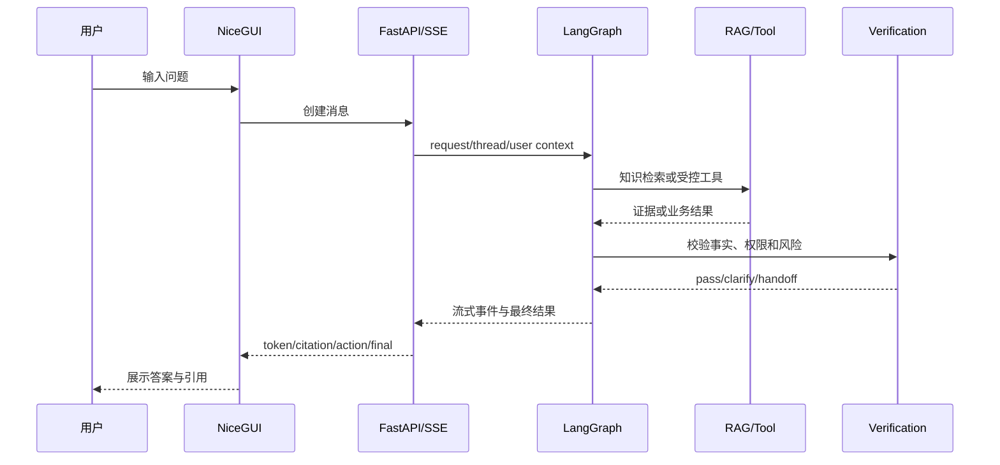

# 产品与系统流程

## 1. 用户咨询流程



## 2. 三段式知识回答

| 结果 | 行为 |
|---|---|
| 高置信度且证据充分 | 直接返回标准答案或证据约束答案 |
| 中置信度 | 返回 3～5 个候选标准问 |
| 低置信度或证据冲突 | 最小澄清、拒答或人工技能组 |

阈值必须通过评估集校准，高风险领域使用更高阈值。

## 3. 文档入库流程

```text
上传 → 安全检查 → SHA256 幂等 → 解析任务
→ 结构恢复 → 语义分块 → 元数据/权限/有效期
→ Embedding + BM25 → 索引版本发布 → 离线抽检
```

解析成功不等于发布成功。只有已审核、有效且权限匹配的知识进入线上检索。

## 4. 业务工具流程

```text
Agent 提出工具请求
→ 工具白名单
→ Pydantic 参数校验
→ 用户身份和数据归属
→ 权限矩阵
→ 幂等/二次确认
→ 执行 Mock 领域服务
→ 结构化结果和审计
→ Verification
```

## 5. 人工交接流程

```text
低置信度/高风险/明确人工
→ 选择技能组
→ 汇总意图、实体、证据和已执行动作
→ 脱敏
→ Mock HumanHandoffService
→ 返回工单编号
```

## 6. 反馈闭环

```text
未命中/负反馈/人工最终答案
→ 问题聚类
→ 运营补充 FAQ 或文档
→ 审核发布
→ 回归评估
→ 灰度上线
```

