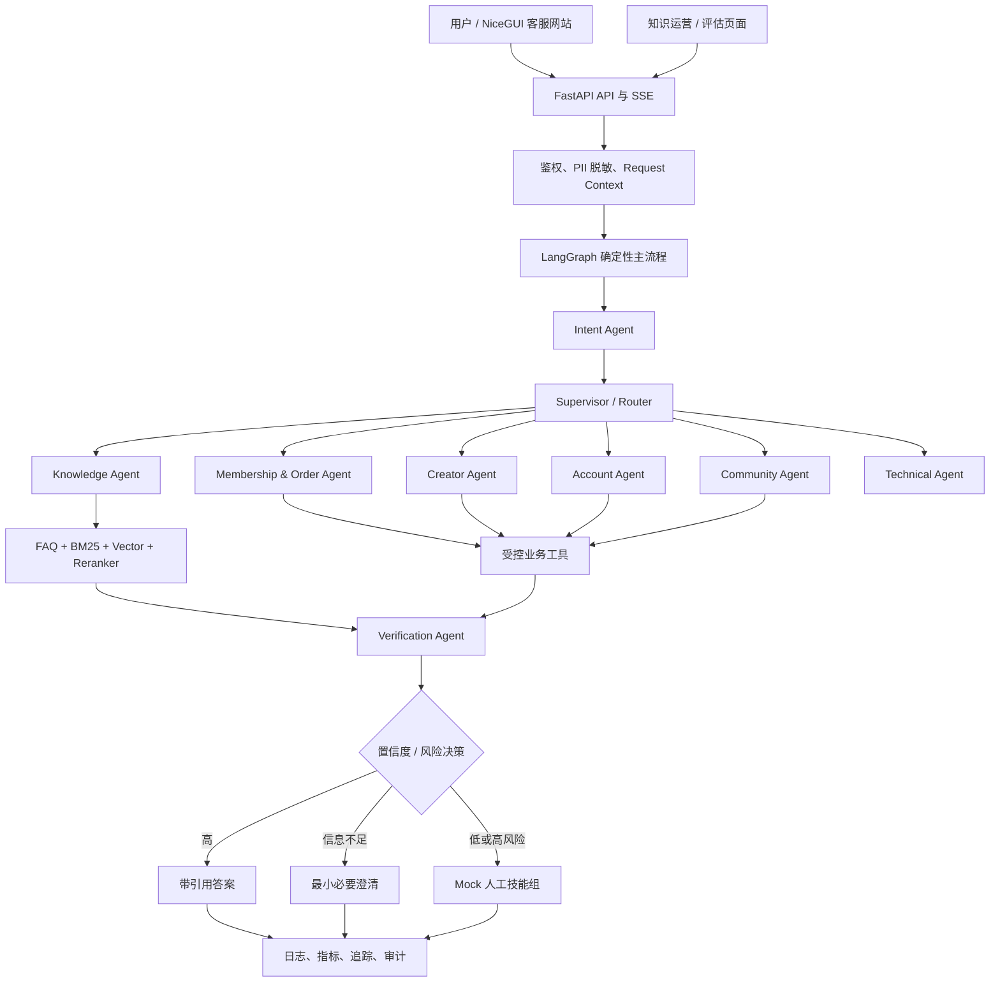
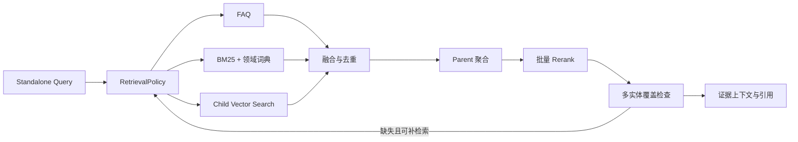
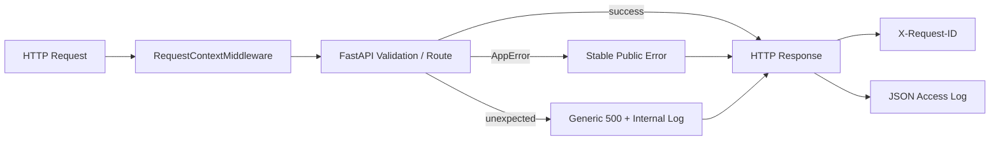

# 最终系统架构

## 1. 逻辑架构



## 2. 分层职责

| 层 | 职责 | 不应承担 |
|---|---|---|
| API/UI | HTTP、SSE、页面、参数校验 | 业务规则和 SQL |
| Application | 用例编排、事务边界 | 具体数据库实现 |
| Graph/Agent | 任务状态、路由、结构化决策 | 自由访问所有工具 |
| Knowledge | 解析、分块、索引、检索、引用 | 用户业务数据查询 |
| Tools | 业务语义接口、权限、幂等、审计 | 自由生成 SQL |
| Repository | 持久化访问 | LLM Prompt 和流程决策 |
| Provider | LLM、Embedding、Rerank、Handoff 适配 | 业务编排 |
| Observability | 指标、追踪、审计 | 修改业务结果 |

## 3. 数据存储

- PostgreSQL：用户、会话、消息、知识元数据、FAQ、工具审计、反馈。
- 文件/Object Storage：原始文档和标准化解析结果。
- FAISS：MVP 向量索引；通过接口支持替换 Qdrant。
- BM25：MVP 本地索引；索引版本与知识版本绑定。
- Checkpoint Store：LangGraph 状态恢复。

## 3.1 检索子流程



Rerank 失败时回退融合排序；补检索最多一次；低质量候选不能为了覆盖而强行进入答案。

## 4. 主工作流

```text
输入与身份上下文
→ PII 脱敏与风险预判
→ 多标签意图和实体识别
→ Supervisor 拆解与路由
→ Knowledge 或受控 Tool
→ Verification 事实、权限、证据和冲突校验
→ 置信度决策
→ 回答 / 澄清 / 二次确认 / 人工技能组
→ 对话、指标和审计落库
```

## 5. 可替换边界

- `LLMProvider`：Mock ↔ OpenAI-compatible。
- `EmbeddingProvider`：Hash Mock ↔ 云端/本地模型。
- `VectorStore`：FAISS ↔ Qdrant。
- `ObjectStorage`：本地 ↔ S3/OSS/MinIO。
- `HumanHandoffService`：Mock ↔ 企业客服/工单系统。
- `BusinessGateway`：仿真 PostgreSQL ↔ 企业领域 API。

## 6. HTTP 请求基础链路



Request ID 使用安全字符和长度约束；访问日志不记录 query value 和请求体。核心 `AppError` 不依赖 FastAPI，Web 边界负责转换 HTTP 状态与错误响应。
