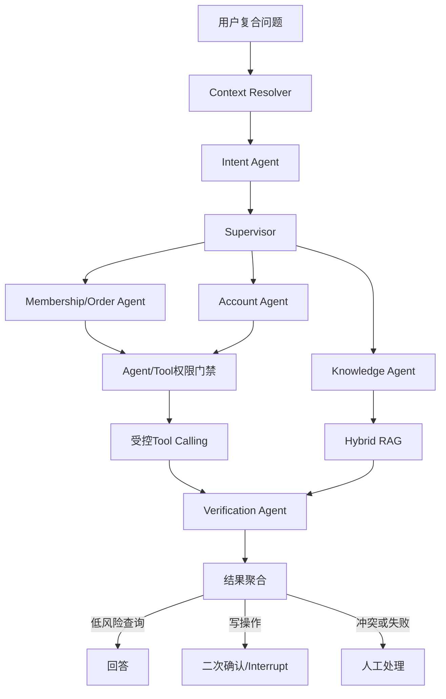
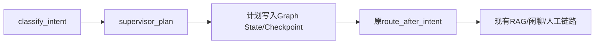

# 第10周：Supervisor、多Agent与受控Tool Calling

> 当前状态：计划已建立，尚未开始编码。当前任务为10A-1多Agent强类型契约。

## 1. 为什么进入这一周

第9周已经把上下文解析、意图识别、RAG、Grounded生成、NLI校验、人工中断和流程回放放入可持久化的
LangGraph。当前系统可以可靠处理一个知识问答目标，但还不能安全处理“会员扣费未到账，同时手机号换了”这类
跨业务域复合问题，也没有真实的Agent工具权限、数据归属、幂等和调用审计。

第10周在第9周确定性Graph之上增加多Agent控制平面和受控业务工具，不采用完全自由的ReAct主流程。



## 2. 本周学习目标

- 理解Agent、Workflow、Tool和普通函数之间的边界；
- 使用Supervisor拆解复合问题，但不允许Supervisor直接生成业务事实；
- 使用强类型任务和结果Schema控制Agent之间的数据交换；
- 根据任务依赖构造并行波次和串行波次；
- 通过注册表和权限矩阵限制Agent可调用的工具；
- 使用可信`UserContext`完成数据归属校验，禁止模型自报用户身份；
- 为写工具实现二次确认、幂等键和审计；
- 聚合多Agent结果并识别事实冲突、缺失和部分失败；
- 把Supervisor和Agent接入第9周Checkpoint、Interrupt和流程回放能力。

## 3. 本周商业化边界

本周不使用固定字符串伪造业务结果。由于无法访问哔哩哔哩内部会员、订单、账号和稿件API，当前使用本地MySQL
建立可替换的仿真业务系统，并通过`BusinessGateway`协议隔离实现。

| 能力 | 本周实现 | 未来替换 |
|---|---|---|
| Supervisor | 规则+结构化模型 | 可替换模型Provider |
| 多Agent编排 | 真实LangGraph节点 | 保持协议不变 |
| 会员/订单等数据 | 本地MySQL仿真数据 | 哔哩哔哩内部领域API |
| 权限和归属 | 真实代码与数据库校验 | 企业IAM/业务鉴权服务 |
| 幂等和审计 | MySQL唯一约束与审计表 | 企业审计平台 |
| 二次确认 | LangGraph Interrupt/Resume | 企业审批或坐席平台 |
| 退款、账号修改 | 不执行真实外部操作 | 获得正式API后接入 |

Agent不能执行任意SQL。所有业务查询和写入必须通过注册工具及Gateway边界。

## 4. 四个实施模块

| 模块 | 学习重点 | 主要产物 | 状态 |
|---|---|---|---|
| 10A | Supervisor控制平面 | 任务Schema、拆解、依赖波次、聚合契约、Graph影子接入 | 进行中 |
| 10B | 受控Tool平台 | MySQL业务数据、Tool注册、权限、归属、幂等和审计 | 未开始 |
| 10C | 领域Agent执行 | Agent授权、并行分派、工具/RAG调用、Verification与冲突处理 | 未开始 |
| 10D | 产品接入与评估 | 正式Graph、二次确认、页面、固定评估集和第10周复盘 | 未开始 |

## 5. 10A：Supervisor控制平面

### 5.1 10A完成目标

把`IntentDecision`转换成有界、可测试、可Checkpoint的`SupervisorPlan`：

```text
IntentDecision
→ AgentTask列表
→ 依赖检查
→ 执行波次
→ AgentResult契约
→ AggregationResult契约
```

10A采用影子模式接入现有Graph：真实生成并保存计划，但仍沿用第9周回答链路，不在工具尚未接入时改变用户回答。



### 5.2 10A任务拆分

| 任务 | 内容 | 主要文件 | 状态 |
|---|---|---|---|
| 10A-1 | 多Agent强类型契约 | `agents/types.py`、`test_agent_types.py` | 待开始 |
| 10A-2 | Supervisor任务规划 | `agents/supervisor.py` | 未开始 |
| 10A-3 | 依赖图和执行波次 | `agents/planning.py` | 未开始 |
| 10A-4 | 多Agent结果聚合 | `agents/aggregation.py` | 未开始 |
| 10A-5 | 第9周Graph影子接入 | `graph/state.py`、`graph/workflow.py` | 未开始 |

## 6. 10A-1：多Agent强类型契约（当前任务）

### 6.1 实现文件

```text
src/bili_support/agents/types.py
tests/unit/test_agent_types.py
```

### 6.2 需要定义的类型

```text
AgentName
AgentTaskStatus
AgentExecutionMode
AgentTask
SupervisorPlan
AgentFactCandidate
AgentResult
AggregationResult
```

### 6.3 AgentName

受控Agent集合：

```text
knowledge
membership_order
account
creator
community
technical
verification
human_handoff
```

不使用任意字符串，防止模型创建`sql_agent`、`refund_everything_agent`等未注册角色。

### 6.4 AgentTask

一个任务至少包含：

```text
task_id
agent
domain
objective
action
depends_on
required_tools
risk
requires_confirmation
```

约束：

- `task_id`使用`task-1`格式；
- 目标不能为空且长度有界；
- 任务不能依赖自己；
- 依赖和工具名不能重复；
- 对象使用`frozen=True`和`extra="forbid"`；
- `required_tools`只是声明，10A不执行工具。

### 6.5 SupervisorPlan

计划至少包含：

```text
original_question
tasks
execution_mode
needs_verification
needs_human_review
planning_source
```

跨字段约束：

- 每个`task_id`唯一；
- 所有依赖必须指向计划内任务；
- 最多6个子任务；
- 单任务不能声明并行；
- 高风险任务必须进入Verification或人工路径。

### 6.6 AgentResult与事实候选

领域Agent不直接返回不可验证的最终回答，而是返回结构化`AgentFactCandidate`：

```text
key
value
source_type = knowledge/tool/policy
source_reference
```

`AgentResult`至少包含：

```text
task_id
agent
status
facts
evidence_ids
tool_call_ids
error_code
```

约束：

- `completed`不能携带`error_code`；
- `failed`必须携带稳定错误码；
- `failed`不能携带看似成功的事实；
- 当前输出称为事实候选，只有Verification通过后才成为可发布事实。

### 6.7 AggregationResult

聚合结果需要表达：

```text
completed / partial / failed / incomplete
facts
conflicts
missing_task_ids
needs_verification
needs_confirmation
needs_human_review
```

10A-1只定义契约，不编写聚合算法。

### 6.8 验收用例

1. 合法单任务计划；
2. 合法双任务并行计划；
3. 重复任务ID被拒绝；
4. 不存在的依赖被拒绝；
5. 自我依赖被拒绝；
6. 超过6个任务被拒绝；
7. 未注册Agent被拒绝；
8. 未知字段被拒绝；
9. `failed`没有错误码被拒绝；
10. `completed`携带错误码被拒绝。

### 6.9 10A-1思考题

1. 为什么`AgentResult.facts`是事实候选，而不是已验证事实？
2. 为什么SupervisorPlan需要限制最大任务数？
3. 为什么Supervisor不能直接返回最终自然语言答案？
4. `extra="forbid"`对模型结构化输出有什么价值？
5. 为什么Agent名称使用枚举，而`objective`保留开放文本？

思考题答案在任务验收完成后补入本文件。

## 7. 10A-2：Supervisor任务规划

### 7.1 目标

实现从`question + IntentDecision`到`SupervisorPlan`的确定性入口：

```python
plan(question=question, decision=decision) -> SupervisorPlan
```

### 7.2 领域映射

```text
membership/order → membership_order
account          → account
creator          → creator
community        → community
technical        → technical
content/知识查询  → knowledge
human_service    → human_handoff
```

### 7.3 规划原则

- 稳定领域映射由代码控制；
- 模型只补充长尾任务拆解，不得创建白名单外Agent；
- 相同领域和动作的重复任务应合并；
- Supervisor只生成计划，不生成业务事实；
- 规划失败进入澄清或人工，不回退为自由回答。

## 8. 10A-3：依赖图和执行波次

### 8.1 目标

将任务依赖转换为可执行波次：

```text
task-1 查询订单
task-2 根据订单结果查询退款
task-3 查询账号状态

wave-1 = [task-1, task-3]
wave-2 = [task-2]
```

### 8.2 必须检测

- 不存在的依赖；
- 自我依赖；
- 循环依赖；
- 高风险写任务错误并行；
- 超过最大任务数或最大波次数。

## 9. 10A-4：结果聚合

### 9.1 确定性聚合状态

```text
全部成功       → completed
部分失败       → partial
全部失败       → failed
缺少任务结果   → incomplete
事实值冲突     → verification_required
高风险写操作   → confirmation_required
```

### 9.2 冲突示例

```text
Agent A：membership_status=active
Agent B：membership_status=expired
```

聚合器不能自行选择其中一个，应记录：

```text
conflicts=[membership_status]
needs_verification=true
```

## 10. 10A-5：Graph影子接入

### 10.1 新增状态

Graph State计划增加：

```text
supervisor_plan
agent_execution_waves
agent_results
aggregation_result
```

### 10.2 接入位置

```text
resolve_context
→ classify_intent
→ supervisor_plan
→ 原有route_after_intent
```

### 10.3 为什么使用影子模式

- 可以先验证任务拆解准确率；
- 不影响现有RAG正确回答；
- 计划会进入MongoDB Checkpoint和9D流程回放；
- 10B/10C完成后再切换到真实Agent执行；
- 避免一次重写整条生产链路。

## 11. 10B：受控Tool平台

计划工具：

```text
get_user_profile
get_membership
get_order
get_refund_status
get_submission_status
get_penalty_case
create_support_ticket
```

每次调用必须依次通过：参数Schema、Agent权限、用户归属、风险、二次确认、幂等和审计。计划使用本地MySQL表
保存仿真业务事实、工具权限、幂等记录和调用审计。

## 12. 10C：领域Agent执行

计划实现Knowledge、Membership/Order、Account、Creator、Community、Technical、Verification和Human Handoff
Agent。Agent只调用授权能力，并统一返回`AgentResult`。无依赖任务可以并行，有依赖任务按执行波次串行。

## 13. 10D：产品接入与评估

计划把影子Supervisor切换为正式多Agent执行，并补充：

- Tool调用审计页面；
- 权限矩阵视图；
- 写操作二次确认；
- Agent执行时间线；
- 复合任务固定评估集；
- Agent路由准确率；
- Tool选择准确率；
- 越权调用拦截率；
- 重复写操作拦截率；
- 冲突检出率。

## 14. 本周贯穿验收场景

### 场景1：复合任务拆解

```text
用户：大会员扣费未到账，同时手机号换了无法登录。
```

应拆为Membership/Order和Account两个可并行任务。

### 场景2：用户越权

用户A查询用户B订单时必须拒绝，且留下稳定错误码和审计记录。

### 场景3：Agent越权

Technical Agent调用退款工具时必须被权限矩阵拦截。

### 场景4：幂等写入

同一幂等键重复创建工单时只能产生一张工单，第二次返回第一次结果。

### 场景5：工具故障

订单工具失败时Agent必须返回失败，模型不能生成“订单正常”等伪造事实。

### 场景6：二次确认

写操作在真正调用工具前进入LangGraph Interrupt，确认后使用`Command.resume`继续。

## 15. 本周代码阅读总路径

```text
agents/types.py             Agent间稳定协议
→ agents/supervisor.py      任务拆解与Agent选择
→ agents/planning.py        依赖图和执行波次
→ agents/aggregation.py     状态、缺失与冲突聚合
→ tools/registry.py         工具注册与Schema
→ tools/permissions.py      Agent权限和用户归属
→ tools/*                   领域工具
→ graph/state.py            多Agent可持久化状态
→ graph/workflow.py         Supervisor、分派、验证和确认节点
→ services/conversations.py 事务、审计和接口接线
```

## 16. 面试重点

完成本周后需要能够回答：

1. Agent和确定性Workflow有什么区别？
2. 为什么Supervisor不能直接生成业务事实？
3. 多Agent任务如何并行，如何处理依赖？
4. 为什么Function Calling参数Schema不等于权限控制？
5. 如何阻止模型伪造用户ID查询他人订单？
6. 写工具如何实现二次确认和幂等？
7. 工具失败时为什么不能回退成模型猜测？
8. 如何聚合部分成功、缺失和冲突结果？
9. 为什么Graph Replay可能造成重复业务副作用？
10. 如何从本地MySQL Gateway平滑替换成企业内部API？

## 17. 第10周完成定义

- 复合问题可以生成有界SupervisorPlan；
- 任务依赖可转换为确定性执行波次；
- 不同Agent只能调用授权工具；
- 工具参数、用户归属、幂等和审计均真实生效；
- 写操作在执行前完成二次确认；
- Agent和工具失败不会被包装成成功事实；
- 多Agent结果可以识别冲突、缺失和部分失败；
- 执行过程进入MongoDB Checkpoint和脱敏时间线；
- 页面可以展示Agent计划、工具审计和确认状态；
- 固定评估集能够说明路由、工具选择和安全拦截效果。

