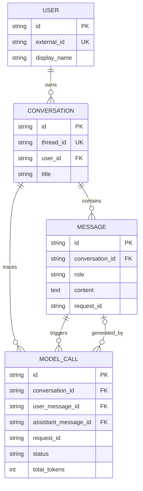

# 第 3 周完成报告：会话、数据库、鉴权与 NiceGUI

> 完成日期：2026-07-19  
> 范围：FastAPI 业务服务、SQLAlchemy 2 异步、Alembic、会话持久化、简单 Token 鉴权、SSE 和 NiceGUI。

## 1. 本周交付结果

第二周的 `/api/v1/chat` 是无状态模型调用；第三周新增了有状态客服链路：

```text
Bearer Token + User Context
→ Conversation API
→ ConversationService
→ Repository
→ SQLAlchemy AsyncSession
→ SQLite（测试）/ MySQL（本地与 Compose）+ Redis 缓存
→ ChatService
→ 持久化消息与模型调用审计
```

| 模块 | 完成内容 |
|---|---|
| 数据层 | User、Conversation、Message、ModelCall 四类实体和索引/约束 |
| 迁移 | Alembic 初始迁移，异步 SQLite/MySQL URL，重复 `upgrade head` 安全 |
| Repository | 用户、会话、消息、模型调用的数据访问边界 |
| Service | 创建/列举会话、历史读取、普通/流式发送、事务和失败审计 |
| 鉴权 | Bearer Token + `X-User-ID`/`X-User-Name` 演示用户上下文 |
| API | 会话创建、列表、历史、普通消息、SSE 消息 |
| UI | `/support/` NiceGUI 客服页面，可创建会话并流式渲染回复 |
| 部署 | 测试可用 SQLite；本地及 Docker Compose 使用 MySQL 8、Redis 和 Alembic |

## 2. 数据模型



`thread_id` 是公开会话标识，内部主键与公开标识分离。模型调用不仅记录 Request ID，还通过外键关联触发调用的用户消息和成功生成的助手消息。因此调用方即使重复使用 Request ID，审计关系仍然明确。

## 3. 分层实现

### 3.1 Database 与 Alembic

`Database` 只负责异步 Engine、Session Factory、开发建表和连接释放。业务代码不能直接使用全局 Session。

测试默认 SQLite，便于零依赖回归；当前本地和 Docker Compose 使用 MySQL，Redis 只缓存模型历史。它们共享 SQLAlchemy 模型与 Alembic 迁移。`database_auto_create` 只用于 SQLite 快速启动，MySQL/生产应先运行迁移。

### 3.2 Repository

Repository 封装查询和持久化表达式：

- `UserRepository`：按外部身份获取或创建本地用户。
- `ConversationRepository`：创建、按用户列举、按用户和 Thread ID 查询。
- `MessageRepository`：按时间读取历史、追加消息。
- `ModelCallRepository`：写入调用审计。

Repository 不调用 LLM、不处理 HTTP，也不决定业务事务。

### 3.3 ConversationService

Service 实现用例和事务边界：

1. 验证会话属于当前用户。
2. 先提交用户消息，保证模型失败时问题仍可恢复。
3. 将已有消息转换成第二周的 `ChatMessage` 历史。
4. 调用 `ChatService.complete()` 或 `stream()`。
5. 成功时保存助手消息和 Token；失败/取消时保存状态和错误码。

流式响应使用独立短事务，不让数据库事务跨越整个模型网络流。这避免长事务长期占用连接或锁。

### 3.4 简单鉴权与用户隔离

请求需要：

```http
Authorization: Bearer local-demo-token
X-User-ID: demo-user
X-User-Name: 演示用户
```

Token 使用常量时间比较；用户 ID 有字符和长度约束。查询会话时同时过滤 `thread_id` 和当前 `user_id`，其他用户访问返回 404，避免泄露资源是否存在。

这是第三周教学用认证边界，不是最终商业认证。生产阶段应替换为 OIDC/OAuth2、企业 SSO 或短期 JWT，用户身份必须来自已验证 Token claims，不能信任客户端自报的 `X-User-ID`。

### 3.5 SSE 和断开处理

持久化流式接口沿用第二周事件协议：

- `delta`：文本增量。
- `completed`：Thread ID、Request ID、结束原因和 Token。
- `error`：稳定错误码与安全公开消息。

API 使用 `aclosing`。客户端断开时，生成器进入 finally，模型调用被标记为 cancelled/stream_closed，不会默默丢失审计状态。

### 3.6 NiceGUI 页面

FastAPI 应用通过 NiceGUI 官方 `ui.run_with` 方式挂载 `/support/`。页面提供 Token、用户信息、Thread ID、新建会话、问题输入和流式回答区域。UI 与 API 复用 `ConversationService`，没有复制数据库和 LLM 业务规则。

## 4. 接口清单

| 方法 | 路径 | 作用 |
|---|---|---|
| POST | `/api/v1/conversations` | 创建当前用户会话 |
| GET | `/api/v1/conversations` | 列举当前用户会话 |
| GET | `/api/v1/conversations/{thread_id}/messages` | 获取完整历史 |
| POST | `/api/v1/conversations/{thread_id}/messages` | 发送并持久化普通回复 |
| POST | `/api/v1/conversations/{thread_id}/messages/stream` | 发送并持久化 SSE 回复 |
| GET | `/support/` | NiceGUI 客服页面 |

第二周无状态 `/api/v1/chat` 和 `/api/v1/chat/stream` 仍保留，用于调试 LLM 层。

## 5. 本地启动

```powershell
cd C:\workspace\agent-action
.venv\Scripts\python.exe -m pip install -e ".[dev]"
Copy-Item .env.example .env
.venv\Scripts\python.exe -m alembic upgrade head
.venv\Scripts\python.exe -m uvicorn bili_support.main:app --reload --port 8010
```

打开：

- 客服页面：<http://127.0.0.1:8010/support/>
- OpenAPI：<http://127.0.0.1:8010/docs>

本地 `.env.example` 开启开发自动建表，因此首次运行即使遗漏 Alembic 也能启动；仍建议手动执行迁移，形成正确习惯。

## 6. API 演示

```powershell
$headers = @{
  Authorization = "Bearer local-demo-token"
  "X-User-ID" = "demo-user"
  "X-User-Name" = "演示用户"
}

$conversation = Invoke-RestMethod -Method Post `
  -Uri http://127.0.0.1:8010/api/v1/conversations `
  -Headers $headers -ContentType "application/json" `
  -Body '{"title":"会员咨询"}'

$threadId = $conversation.data.thread_id

Invoke-RestMethod -Method Post `
  -Uri "http://127.0.0.1:8010/api/v1/conversations/$threadId/messages" `
  -Headers $headers -ContentType "application/json" `
  -Body '{"content":"大会员有哪些权益？"}'
```

重启服务后再次调用 history 接口，消息仍然存在。

## 7. MySQL/Redis Compose

```powershell
docker compose up --build
```

Compose 会：

1. 启动 MySQL 8 和 Redis 7。
2. 等待 `mysqladmin ping` 与 `redis-cli ping` 健康检查通过。
3. API 容器执行 `alembic upgrade head`。
4. 使用非 root 用户启动 Uvicorn。

MySQL 密码和 Demo Token 只适用于本地 Compose，生产必须通过 Secret Manager 注入。

## 8. 验收结果

```text
Ruff:   passed
mypy:   85 source files passed in strict mode
pytest: 106 passed
Alembic: upgrade head repeated successfully
```

关键场景：

- 未认证、错误 Token 和非法用户 ID 被拒绝。
- 用户只能看到自己的会话。
- 普通消息和 SSE 消息都会持久化。
- 应用重启后可继续历史 Thread。
- 模型失败时保留用户消息并写入错误调用。
- Request、用户消息、助手消息和 ModelCall 可直接关联。
- 初始迁移可以重复执行。
- NiceGUI 页面可访问。

## 9. 思考题与答案

### 1. 为什么使用 AsyncSession？

数据库和模型调用都是 I/O。异步 Session 能在等待数据库时释放事件循环，让同一进程处理其他请求；它不意味着一个 Session 可以被多个协程并发共享。

### 2. 为什么 Session 不能做全局单例？

Session 保存事务和实体状态。全局共享会造成请求间事务污染、并发错误和难以回滚。正确方式是一次短业务操作一个 Session。

### 3. Repository 和 Service 有什么区别？

Repository 表达如何读写数据；Service 表达业务用例、权限判断、事务顺序以及如何协调 LLM。Repository 不应知道 HTTP 和 Prompt。

### 4. 为什么先提交用户消息再调用模型？

模型可能超时或不可用。先保存问题后，用户可以重试、人工客服可以看到问题，系统也能审计失败。如果把整个过程放在一个事务里，失败回滚会丢掉用户输入。

### 5. 为什么不能让事务跨越整个 SSE？

模型流可能持续几十秒。长事务会占用连接、持有锁并增加死锁与连接池耗尽风险。流前、流后使用短事务更安全。

### 6. Thread ID 与数据库主键为什么分开？

公开标识和内部存储标识的生命周期、格式与暴露范围不同。分离后可以迁移内部模型，而不破坏客户端协议。

### 7. 为什么其他用户访问会话返回 404，而不是 403？

403 会确认资源存在。404 同时保护资源存在性，并保持“当前用户看不到该资源”的稳定语义。

### 8. 为什么要显式关联 user_message_id？

Request ID 可能由调用方重复使用。数据库外键可以准确回答“哪条用户消息触发了哪次模型调用”，不会依赖弱唯一的日志字段。

### 9. 失败调用为什么也要落库？

失败率、超时、供应商稳定性、用户重试和成本治理都需要失败样本。只记录成功会造成幸存者偏差。

### 10. 为什么测试 SQLite、运行 MySQL？

SQLite 降低单元和集成测试门槛；MySQL 与当前本地基础设施一致，更适合持久运行和并发事务。通过 SQLAlchemy 与 Alembic 约束二者公共子集，Redis 仅作为可丢弃缓存。

### 11. `create_all` 能代替 Alembic 吗？

不能。`create_all` 适合空数据库快速建表，不会可靠管理已有表的演进和版本。Alembic 才是可追踪、可审查、可回滚的 schema 变更机制。

### 12. 迁移“幂等”是什么意思？

对同一个数据库重复执行 `alembic upgrade head`，第二次不会重复建表或破坏数据，因为 Alembic 根据版本表只运行未应用的 revision。

### 13. 为什么共享 Demo Token 不是生产鉴权？

它只证明调用者知道一个共同秘密，不能可靠证明具体用户身份、撤销单个用户或表达权限。生产应验证由身份提供方签发的 claims。

### 14. 为什么 UI 复用 Service，而不是自己写 SQL？

API 与 UI 如果各写一套业务逻辑，会产生权限和事务差异。复用 Service 保证行为一致，也便于测试。

### 15. `/ready` 为什么包含 database？

会话能力依赖数据库。应用生命周期中的建表或连接初始化失败会阻止服务进入 ready；探针结果也明确表达数据库已经完成装配。

## 10. 已知边界与第四周衔接

- 当前认证是可替换 Mock，后续增加 JWT/OIDC 与权限声明。
- 当前会话标题手工提供，后续可以异步生成摘要标题。
- 当前无分页；数据量增长后为会话和消息使用游标分页。
- 当前 SQLite 自动建表仅为本地便利，生产只允许 Alembic。
- 当前主机没有 Docker CLI；Compose YAML 已解析验证，MySQL/Redis 容器和镜像构建需在安装 Docker 的环境执行。
- 课程于 2026-07-20 重排：第四周先学习意图识别与结构化决策；文档 Loader、任务表和上传接口移为第五周自动底座，学习者第五周只重点研究知识表示、Chunk 与 Small-to-Big。

## 11. 参考

- [NiceGUI official repository](https://github.com/zauberzeug/nicegui)
- [SQLAlchemy asyncio documentation](https://docs.sqlalchemy.org/en/20/orm/extensions/asyncio.html)
- [Alembic documentation](https://alembic.sqlalchemy.org/)
