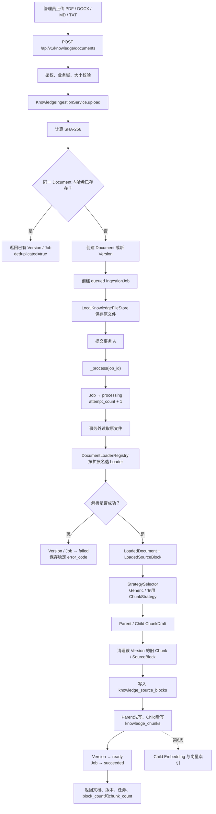

# 第 5 周学习记录：RAG 知识表示与 Chunk

> 开始日期：2026-07-25  
> 学习重点：文档进入模型上下文之前，如何保存结构、语义、权限和可追溯性。

## 1. 本周最终目标

完成哔哩哔哩企业客服知识库的第一段完整链路：

```text
PDF / DOCX / Markdown / TXT
  → 文件校验与幂等
  → 文档解析
  → 结构化块
  → Parent / Child Chunk
  → 数据库存储
  → 可追溯调试结果
```

本周不学习向量数据库和相似度检索，它们属于第六周。当前先保证“放进知识库的内容是正确的”，
否则后续 Embedding 只会更快地召回错误、残缺或失去上下文的文本。

## 2. 模块划分

| Step | 内容 | 学习分工 |
|---|---|---|
| 5A | 文档、版本、解析任务、结构块和 Chunk 契约；Loader 与入库底座 | 工程代码由 Codex 自动完成，重点理解数据契约 |
| 5B | Policy/Manual/FAQ/Table/Generic 分块；Small-to-Big | 本周 AI 核心，重点理解和实现 Chunk 策略 |
| 5C | 固定 Chunk 数据集、策略比较、失败分析和调试接口 | 重点理解如何量化“分块是否正确” |

## 3. Step 5A：文档入库契约与自动工程底座（已完成）

### 3.1 要解决的问题

知识库不能只保存一段纯文本。每个 Chunk 至少要回答：

- 来自哪个文件、哪个版本和哪一页；
- 位于哪个标题路径；
- 是普通段落、FAQ、政策条款还是表格；
- 属于哪个哔哩哔哩业务域；
- 哪些用户或角色可以检索；
- 何时生效、何时失效；
- Child 命中后应返回哪个 Parent；
- 原文件更新后，旧 Chunk 如何失效并重建。

### 3.2 Codex 自动实现范围

- 文档、版本、解析任务、结构块、Chunk 数据模型和迁移；
- PDF、DOCX、Markdown、TXT Loader；
- SHA-256 文件幂等和版本关系；
- 上传、状态、失败重试、版本查询和删除接口；
- 解析错误码、状态机、Fixture 和测试；
- Mock 调度：本阶段不引入真实消息队列；
- 为 5B 提供稳定的结构化解析结果，不提前实现向量检索。

### 3.3 你需要掌握的核心契约

本步骤结束后，需要能够解释：

1. `Document`、`DocumentVersion`、`IngestionJob`、`SourceBlock`、`Chunk` 为什么不能合成一张表；
2. 文件哈希幂等与文档版本管理有什么区别；
3. 为什么 Loader 不应该直接输出最终向量 Chunk；
4. 页码、标题路径、权限和有效期为什么必须在分块前保留；
5. 解析失败为什么要记录稳定错误码并允许重试。

### 3.4 验收标准

- 四种文件类型能够进入同一个结构化 Loader 契约；
- 同一文件重复上传不会重复建版本；
- 文件内容变化会形成新版本；
- 每个结构块能追溯到文件、页码或标题路径；
- 表格不会在 Loader 阶段被压成无法恢复的普通字符串；
- 失败任务可定位、可重试，不影响其他文档；
- 后续 5B 可以只关注 Chunk 策略，不需要修改 Loader 和数据库边界。

## 4. 本步骤开始前的思考题与答案

### 问题一：为什么不能直接把 PDF 全文交给大模型？

全文通常超过上下文预算，而且检索粒度过粗。页眉、页脚、目录和跨页表格还会制造噪声。正确做法
是先保存文档结构，再根据知识类型生成可检索 Child 和可回答 Parent。

### 问题二：Loader 和 Chunker 的区别是什么？

Loader 负责忠实恢复源文档内容和结构；Chunker 负责针对检索目标重新组织文本。Loader 的输出应
尽量可逆，Chunker 的输出则针对召回率、完整性和上下文预算优化。

### 问题三：为什么同一个文件哈希不能代表永久不变的知识？

哈希只能证明字节是否相同。知识是否有效还取决于版本状态、生效时间、业务域、权限和是否已被新
版本替代。因此文件幂等和知识生命周期是两个不同问题。

## 5. Step 5A 实现结论

### 5.1 五个对象各自负责什么

| 对象 | 职责 | 不能合并的原因 |
|---|---|---|
| `KnowledgeDocument` | 逻辑知识、业务域、权限和软删除状态 | 一个逻辑知识可以有多个文件版本 |
| `KnowledgeDocumentVersion` | 一次不可变文件快照、哈希和存储位置 | 幂等、回滚和重建索引都以版本为边界 |
| `KnowledgeIngestionJob` | 一次解析尝试、状态、次数和错误码 | 失败重试不能篡改文件版本本身 |
| `KnowledgeSourceBlock` | Loader 忠实恢复出的标题、段落、列表和表格 | 它描述原文结构，不承担检索优化 |
| `KnowledgeChunk` | Parent/Child 检索单元 | 同一结构块可按不同策略重新分块 |

状态流转为：

```text
Version: pending ───────────────→ ready
              └───────────────→ failed

Job: queued → processing → succeeded
                    └────→ failed → retry → processing
```

### 5.2 Loader 统一契约

四种 Loader 都输出 `LoadedDocument`，内部包含有序 `LoadedSourceBlock`。每个结构块保留：

- `ordinal`：原文顺序；
- `block_type`：heading、paragraph、list 或 table；
- `content`：可读文本；
- `page_number`：PDF 来源页；
- `heading_path`：Markdown/DOCX 的标题层级；
- `metadata`：表格列名、行号等结构信息。

表格采用“每一行重复列名”的规范化表达。例如 `权益 | 有效期` 不会只变成孤立的单元格值，
而会形成 `权益: 1080P；有效期: 31天`。这样后续切成 Child 时仍保留列语义。

### 5.3 幂等和版本的边界

SHA-256 只在同一 `Document` 内判断文件字节是否已经入库：

- 相同标题、业务域和创建人构成同一逻辑文档；
- 相同哈希直接返回已有版本和任务，不重复解析；
- 哈希不同创建递增的新版本；
- 调用方也可以显式传入 `document_id` 为指定文档新增版本。

### 5.4 安全和商业化边界

- 文件名只取安全 basename，存储键由服务端版本 ID 构造；
- 上传读取有硬上限，不会先把无限大请求完整读进内存；
- 业务域由稳定枚举约束；
- 查询、版本、任务、重试和删除都校验创建人隔离；
- 删除采用软删除，为后续审计和索引失效保留依据；
- 对外只返回稳定解析错误码，不泄露解析器内部异常。

当前任务执行仍是进程内同步 Mock，这是有意保留的调度替换点。生产版应把 `_process(job_id)`
交给持久化消息队列，并增加病毒扫描、对象存储、租户级 RBAC、配额、并发幂等锁和孤儿文件清理。

### 5.5 推荐阅读路径

不要从最大的 `service` 文件硬读。推荐先认识数据，再沿一次真实请求倒着拼装：

1. `knowledge/types.py`：先理解 Loader 的统一输出是什么；
2. `models/entities.py`：理解输出最终保存到哪五张表；
3. `knowledge/loaders/base.py`：理解如何选择解析器和归一化错误；
4. `knowledge/loaders/implementations.py`：对比四种文件如何恢复结构；
5. `knowledge/table_normalization.py`：理解表格语义为什么不能丢；
6. `knowledge/storage.py`：理解原文件如何安全、不可变地保存；
7. `repositories/knowledge.py`：观察数据库查询边界；
8. `services/knowledge.py`：串起哈希、版本、任务、解析和失败重试；
9. `api/knowledge.py`：最后看 HTTP 输入如何进入 Service；
10. `main.py`：查看 Loader、文件存储和 Service 如何在应用启动时组装。

### 5.6 跟读一次完整上传请求

假设管理员上传 `membership.md`：

```http
POST /api/v1/knowledge/documents
Authorization: Bearer local-demo-token

title=大会员规则
business_domain=membership
access_scope=public,support
file=# 大会员\n\n## 自动续费\n\n关闭后下月不再扣费。
```

#### 第一站：`api/knowledge.py::upload_document`

阅读时观察四件事：

1. `actor` 不是客户端任意提交的用户 ID，而是鉴权依赖产生的 `UserContext`；
2. `BusinessDomain` 限制业务域只能使用系统支持的枚举；
3. 文件最多读取“配置上限 + 1”字节，Service 因而能判断超限，同时不会无限占用内存；
4. API 不写数据库，只把输入转换后交给 `KnowledgeIngestionService.upload`。

这一层应保持“薄”。如果把哈希、版本查询和文件解析都写在路由里，将来 CLI、后台管理页或消息
消费者就无法复用同一套业务规则。

#### 第二站：`services/knowledge.py::upload`

按以下断点顺序阅读：

```text
清理文件名、校验大小
  → 计算 SHA-256
  → 得到当前数据库用户
  → 查找或校验逻辑 Document
  → 在该 Document 内按哈希查 Version
  → 命中：返回已有 Version
  → 未命中：创建 Version + queued Job + 保存原文件
  → 提交事务
  → 调用 _process(job_id)
```

这里有两个容易混淆的判断：

- `active_document_by_identity` 回答“它属于哪个逻辑知识”；
- `version_by_hash` 回答“这个逻辑知识的相同文件是否已经上传过”。

如果只做哈希去重，不建立 `Document`，那么“两个部门恰好上传同一模板”可能被错误合并；如果只
建立 `Document` 而不做哈希，同一个文件重复点击上传又会产生大量无意义版本。

#### 第三站：`services/knowledge.py::_process`

该方法故意分为两段短事务：

```text
事务 A：Job → processing，attempt_count + 1
             ↓ commit
数据库事务外：读取文件 → Registry 选择 Loader → 解析 LoadedDocument
             ↓
事务 B：清理本版本旧 SourceBlock → 写入完整新结果
        Version → ready，Job → succeeded
```

解析 PDF 或 DOCX 可能耗时较长。如果解析期间一直持有数据库事务，会长期占用连接并扩大锁冲突。
所以数据库只负责保存状态，慢速解析放在事务之外。

解析失败则走 `_mark_failed`：

```text
Version.status = failed
Job.status = failed
Job.error_code = DOCUMENT_SIGNATURE_MISMATCH / DOCUMENT_PARSE_FAILED / ...
```

重试不会创建新文件版本，因为失败的是一次处理尝试，不是文件内容发生了变化。

#### 第四站：`loaders/base.py::DocumentLoaderRegistry.load`

注册表先通过扩展名选择 Loader，然后由具体 Loader 检查文件签名。例如把普通文本改名为
`broken.pdf`，扩展名会选择 `PdfLoader`，但 `%PDF` 签名检查会返回
`DOCUMENT_SIGNATURE_MISMATCH`。

异常分为两类：

- `DocumentLoadError`：已经是稳定业务错误，原样上抛；
- 其他异常：统一转换成 `DOCUMENT_PARSE_FAILED`，不把第三方库异常暴露给 API。

#### 第五站：四种 Loader

逐个对照输入和输出：

| Loader | 自然边界 | 关键追溯信息 |
|---|---|---|
| PDF | 页内文本块、页内表格 | `page_number`、`page_count` |
| DOCX | Word 正文中的标题、段落、列表、表格顺序 | `heading_path` |
| Markdown | `#` 标题、空行段落、Markdown 表格 | `heading_path` |
| TXT | 空行分段 | 编码回退结果 |

此时输出的是 `LoadedSourceBlock`，不是 `KnowledgeChunk`。例如一段 3000 字的政策条款仍可以是
一个 SourceBlock；5B 才决定它要生成几个 Child、返回哪个 Parent。

#### 第六站：`repositories/knowledge.py`

Repository 不判断“谁能访问、失败能否重试”，它只表达持久化操作。重点阅读：

- `active_document_by_identity`：寻找逻辑文档；
- `version_by_hash`：同一文档内去重；
- `next_version_number`：生成展示用版本号；
- `latest_job_for_version`：重复上传时恢复已有任务结果；
- `delete_blocks`：重试成功写入前清理旧解析结果。

业务规则留在 Service、SQL 查询留在 Repository，可以分别测试，也便于以后把 MySQL 查询优化而
不改变 API 行为。

### 5.7 用数据库结果验证你的理解

一次首次成功上传应形成：

```text
knowledge_documents          1 行：逻辑文档
knowledge_document_versions  1 行：文件 v1
knowledge_ingestion_jobs     1 行：succeeded
knowledge_source_blocks      N 行：标题、段落、表格等
knowledge_chunks             M 行：5B生成的Parent和Child
```

相同文件再次上传：

```text
Document 数量不变
Version 数量不变
Job 数量不变
响应 deduplicated = true
```

修改文件内容再上传：

```text
Document 数量不变
新增 Version v2
新增一个 Job
新增 v2 对应的 SourceBlock
```

### 5.8 Step 5A 自测题与答案

**问题一：为什么 API 不能直接调用 `PdfLoader`？**

因为 API 不应该知道文件类型实现。它只接收请求，Registry 负责选择 Loader，Service 负责业务
编排。否则新增 DOCX 或后台任务入口时都要修改 HTTP 路由。

**问题二：为什么任务失败后不删除 Version？**

Version 是已经接收过某份文件的事实，也是原文件、哈希和失败记录的载体。保留它才能审计和重
试；删除后只剩一个无法解释的失败日志。

**问题三：为什么 `SourceBlock` 和 `Chunk` 必须分开？**

SourceBlock 追求忠实恢复原文，Chunk 追求检索效果。分开后可以重新实验分块策略，而不用反复解
析原文件，也不会因检索优化破坏文档结构。

**问题四：为什么不能在解析开始前一直保持数据库事务？**

文件读取和 PDF/DOCX 解析属于慢速外部工作。长事务会占用连接、持锁并增加失败回滚范围。两段短
事务能分别可靠记录“开始处理”和“完整结果”。

**问题五：为什么软删除比立即物理删除更合适？**

商业客服需要审计知识何时存在、由谁上传、曾经生成过什么版本。软删除先让知识退出有效集合，
后续再由独立保留策略清理原文件和历史数据。

## 6. 当前任务：Step 5B 结构化 Chunk 与 Small-to-Big

### 6.1 要完成什么

把 `SourceBlock` 转换为两层知识单元：

- **Parent Chunk**：保留足够完整的章节、条款、FAQ 或表格上下文，用于最终回答；
- **Child Chunk**：更短、更聚焦，未来用于关键词和向量召回；
- Child 必须通过 `parent_chunk_id` 找回 Parent；
- 标题路径、业务域、权限、版本、页码等元数据必须继承；
- 不同知识类型使用不同策略，不能只按固定字符数粗暴切割。

### 6.2 本步骤的核心学习问题

1. 为什么“检索文本”和“给模型看的回答上下文”不应总是同一段？
2. 政策条款、操作手册、FAQ 和表格分别应该按什么边界切？
3. 重叠窗口能解决什么问题，又会制造什么重复噪声？
4. 如何保证一个 Child 的命中可以稳定还原到唯一 Parent？

### 6.3 先修正一个分类概念

`Policy`、`Manual`、`FAQ`、`Generic` 描述的是整份文档采用哪类知识组织方式；`Table` 描述的是
文档内部某个 SourceBlock 的结构。它们不应该被放在同一个互斥枚举中：

```text
DocumentKnowledgeType
├── POLICY
├── MANUAL
├── FAQ
└── GENERIC

SourceBlockType
├── HEADING
├── PARAGRAPH
├── LIST
└── TABLE
```

策略选择采用两层规则：

```text
如果 SourceBlock.block_type == TABLE
    使用 TableChunkStrategy
否则
    按 DocumentKnowledgeType 选择 Policy / Manual / FAQ / Generic 策略
```

例如一份操作手册仍可能包含价格表。正文应使用 Manual 策略，表格块则应使用 Table 策略。

### 6.4 5B 只拆成三个实施模块

| 模块 | 内容 | 产出 |
|---|---|---|
| 5B-1 | Chunk 契约、策略接口、Generic 基线 | 一个 SourceBlock 能生成一个 Parent 和多个 Child |
| 5B-2 | Policy、Manual、FAQ、Table 专用策略 | 不同知识结构按自己的语义边界分块 |
| 5B-3 | 持久化接入和 Small-to-Big | 入库成功后写入 Chunk，Child 命中可还原 Parent |

`knowledge_type` 字段、API 参数、数据库迁移、Repository 写入等工程底座由 Codex 自动完成；你重点
理解并实现策略边界，不需要把精力放在 CRUD 上。

## 7. 5B-1 Chunk 契约与 Generic 基线（已完成）

### 7.1 写在哪里

主要文件：

```text
src/bili_support/knowledge/chunking.py
```

Small-to-Big 在 5B-3 实现于：

```text
src/bili_support/knowledge/small_to_big.py
```

### 7.2 先理解输入和输出

输入不是整个 PDF，而是一组已经解析好的 SourceBlock：

```python
[
    LoadedSourceBlock(
        ordinal=0,
        block_type=SourceBlockType.HEADING,
        content="自动续费",
        heading_path=("大会员", "自动续费"),
    ),
    LoadedSourceBlock(
        ordinal=1,
        block_type=SourceBlockType.PARAGRAPH,
        content="大会员到期前一天会自动续费。用户可以在支付渠道关闭续费。",
        heading_path=("大会员", "自动续费"),
    ),
]
```

期望输出：

```text
Parent
  content = 标题路径 + 完整段落
  kind = parent

Child 1
  content = 大会员到期前一天会自动续费。
  parent_ref = Parent

Child 2
  content = 用户可以在支付渠道关闭续费。
  parent_ref = Parent
```

未来检索只索引两个 Child。命中 Child 2 后，不直接把短句交给大模型，而是通过 Parent 返回包含标
题和完整段落的上下文。

### 7.3 建议契约样例

这一段是结构样例，不是要求逐字复制：

```python
from enum import StrEnum
from typing import Protocol

from pydantic import BaseModel, ConfigDict, Field

from bili_support.knowledge.types import LoadedSourceBlock


class ChunkKind(StrEnum):
    PARENT = "parent"
    CHILD = "child"


class DocumentKnowledgeType(StrEnum):
    POLICY = "policy"
    MANUAL = "manual"
    FAQ = "faq"
    GENERIC = "generic"


class ChunkDraft(BaseModel):
    """尚未写数据库的分块结果。"""

    model_config = ConfigDict(frozen=True, extra="forbid")

    local_id: str
    kind: ChunkKind
    content: str = Field(min_length=1)
    source_block_ordinal: int = Field(ge=0)
    parent_local_id: str | None = None
    metadata: dict[str, object] = Field(default_factory=dict)


class ChunkStrategy(Protocol):
    def chunk(
        self,
        *,
        blocks: tuple[LoadedSourceBlock, ...],
    ) -> tuple[ChunkDraft, ...]: ...
```

为什么先使用 `local_id`，而不是直接生成数据库 `parent_chunk_id`？

策略层应该是纯函数，不应该依赖数据库。它先产生：

```text
parent-0
child-0-0 → parent-0
child-0-1 → parent-0
```

5B-3 持久化时再把这些局部引用映射为真正的 UUID。

### 7.4 Generic 策略需要完成的逻辑

`GenericChunkStrategy` 第一版只完成以下规则：

1. 忽略独立 `HEADING` 块，但通过正文的 `heading_path` 把标题写入 Parent；
2. 每个非空正文 SourceBlock 先生成一个 Parent；
3. Parent 内容格式为“标题路径 + 正文”；
4. 正文未超过 `child_max_chars` 时只生成一个 Child；
5. 超过上限时优先按中文句号、问号、叹号和换行切分；
6. 单句仍然过长时，才退化为固定字符窗口；
7. Child 保存 `parent_local_id`、页码、标题路径和源块序号；
8. 不能产生空 Child，也不能丢失非空正文内容。

建议构造参数：

```python
GenericChunkStrategy(
    child_max_chars=160,
    child_overlap_chars=20,
)
```

第一版不要引入 Tokenizer。字符数易于观察，5C 再比较字符切分与 Token 切分的差异。

### 7.5 标题路径的拼接样例

输入：

```python
heading_path = ("大会员", "自动续费")
content = "用户可以在支付渠道关闭自动续费。"
```

Parent：

```text
标题：大会员 > 自动续费
正文：用户可以在支付渠道关闭自动续费。
```

Child 可以保留更紧凑的检索文本：

```text
大会员 / 自动续费：用户可以在支付渠道关闭自动续费。
```

标题词进入 Child 后，用户查询“怎么关闭大会员自动续费”更容易命中；完整 Parent 则为最终回答提
供所属章节和原文上下文。

### 7.6 重叠窗口应该怎么理解

原文：

```text
关闭自动续费后，本月权益不受影响。会员将在当前周期结束后失效。
```

如果边界恰好切在两句之间，第二个 Child 可能只有“会员将在当前周期结束后失效”，缺少“关闭自
动续费”这个条件。少量 overlap 可以把条件带入下一块。

但 overlap 不是越大越好：

- 太小：跨边界语义仍然断裂；
- 太大：索引中出现大量重复文本，多个几乎相同结果挤占 Top-K；
- 第一版建议不超过 Child 大小的 10%～15%；
- 句子边界完整时，不必为了凑固定数值强行重叠。

### 7.7 本任务完成标准

用下面四个输入自行观察输出即可，测试不作为学习门禁：

1. 一个短段落：生成 1 Parent + 1 Child；
2. 一个包含三句话的长段落：生成 1 Parent + 多个 Child；
3. 带两级 `heading_path`：Parent 和 Child 都能看到标题语义；
4. 一个超过上限的无标点长字符串：仍能安全退化切分，不死循环、不丢文本。

### 7.8 5B-1 思考题与答案

**问题一：为什么 Parent 不直接参与第一阶段检索？**

Parent 通常更长，包含更多背景和多个事实，向量或关键词表示容易被稀释。Child 更聚焦，适合提高
召回精度；命中后再扩大到 Parent，兼顾召回和回答完整性。

**问题二：为什么不能每 160 个字符直接切一次？**

固定字符窗口可能从一个术语、条件或句子中间切断。优先在自然句子边界切分，只有单句本身超过上
限时才使用固定窗口，可以减少语义残缺。

**问题三：为什么标题要同时进入元数据和文本？**

元数据用于过滤、展示和追溯，但普通向量模型或 BM25 不一定读取独立元数据字段。把精简标题放进
Child 文本能提升召回；同时保留结构化 `heading_path` 才方便后续展示和策略调整。

**问题四：为什么 Strategy 不直接创建 ORM `KnowledgeChunk`？**

策略是需要频繁实验的纯算法。若直接依赖数据库，会让单元实验、离线评估和策略比较变慢，也把事
务与 UUID 生成混入分块逻辑。`ChunkDraft` 是算法层和持久化层之间的稳定边界。

### 7.9 实际实现结构

实现文件：

```text
src/bili_support/knowledge/chunking.py
```

从上到下分成六层：

```text
ChunkKind / DocumentKnowledgeType
  ↓ 稳定枚举
ChunkDraft
  ↓ 校验Parent/Child引用
ChunkStrategy
  ↓ 统一策略接口
GenericChunkStrategy.chunk
  ↓ 编排每个SourceBlock
_split_content / _pack_sentences / _split_oversized_sentence
  ↓ 句子边界、装箱、滑动窗口
_format_parent_content / _format_child_content / _block_metadata
  ↓ 文本格式与追溯元数据
```

### 7.10 跟读一个具体输入

输入：

```python
LoadedSourceBlock(
    ordinal=1,
    block_type=SourceBlockType.PARAGRAPH,
    content="大会员会自动续费。用户可以在支付渠道关闭续费。",
    page_number=2,
    heading_path=("大会员", "自动续费"),
)
```

#### 第一步：`GenericChunkStrategy.chunk`

先检查 `ordinal=1` 是否重复。因为 `ordinal` 会进入：

```text
parent-1
child-1-0
child-1-1
```

重复 ordinal 会造成 local ID 和父子引用冲突，因此直接失败，而不是静默覆盖。

随后判断块类型。`HEADING` 被跳过；PARAGRAPH、LIST 和当前 Generic 回退下的 TABLE 会继续处理。

#### 第二步：生成 Parent

`_format_parent_content` 得到：

```text
标题：大会员 > 自动续费
正文：大会员会自动续费。用户可以在支付渠道关闭续费。
```

对应：

```text
local_id = parent-1
kind = parent
parent_local_id = None
```

Parent 保留完整 SourceBlock，不承担第一阶段精确召回。

#### 第三步：切分正文

`_split_content` 先统一 Windows/Unix 换行，然后按标点或换行得到自然句子：

```text
大会员会自动续费。
用户可以在支付渠道关闭续费。
```

`_pack_sentences` 尽量把相邻短句放进同一 Child 正文，但不会超过 `child_max_chars`。

如果某一个句子本身已经超过上限，才进入 `_split_oversized_sentence`：

```text
step = child_max_chars - child_overlap_chars
```

初始化时强制 `overlap < max`，保证 `step > 0`，从契约上避免滑窗死循环。

#### 第四步：生成 Child

`_format_child_content` 把标题压缩成检索前缀：

```text
大会员 / 自动续费：用户可以在支付渠道关闭续费。
```

对应：

```text
local_id = child-1-0
kind = child
parent_local_id = parent-1
```

标题前缀不计入 `child_max_chars`。上限约束的是正文预算，否则长标题会让不同章节的正文可用长度
忽大忽小。

#### 第五步：继承追溯信息

Parent 和 Child 都保存：

```json
{
  "heading_path": ["大会员", "自动续费"],
  "page_number": 2,
  "source_block_type": "paragraph",
  "source_metadata": {},
  "body_char_count": 25
}
```

`source_metadata` 使用独立命名空间，防止 Loader 自定义字段覆盖 `page_number` 等系统字段。

### 7.11 阅读代码的推荐顺序

1. 先读 `ChunkDraft` 的 `validate_parent_reference`，理解合法父子关系；
2. 再读 `GenericChunkStrategy.__init__`，理解窗口参数为什么快速失败；
3. 阅读 `chunk` 主循环，只观察“跳过标题 → Parent → Child”的顺序；
4. 阅读 `_split_content` 和 `_pack_sentences`，理解自然边界优先；
5. 最后读 `_split_oversized_sentence`，手算一次 `max=5, overlap=2`；
6. 对照 `tests/unit/test_knowledge_chunking.py` 的短段落、自然句和超长句样例。

手算超长句 `abcdefghijk`：

```text
max = 5
overlap = 2
step = 3

start=0  → abcde
start=3  → defgh
start=6  → ghijk
```

这能直观看出 overlap 只用于保留退化窗口的边界上下文。

### 7.12 从上传文件到分块的完整阅读路径

当前真实链路已经贯通到Parent回溯：

```text
当前已接通：上传 → 原文件存储 → Loader → SourceBlock → Strategy → KnowledgeChunk
当前已接通：Child命中 → 批量查询Child → Parent去重保序 → 批量查询Parent
第6周待实现：Child Embedding → 向量数据库 → 检索
```

#### 流程图



#### 按一次真实请求阅读

**第零站：应用装配**

从 `main.py::create_app` 开始，但只看 `knowledge_service` 的构造：

```text
Database
LoaderRegistry
LocalKnowledgeFileStore
max_file_bytes
    ↓
KnowledgeIngestionService
```

这里体现依赖注入：Service 不在内部创建 MySQL、Loader 或文件存储，所以测试可以替换数据库根目
录，生产环境也可以把本地存储替换为 OSS/S3。

**第一站：HTTP 入口**

进入 `api/knowledge.py::upload_document`：

```text
authenticate → UserContext
UploadFile → 上限+1字节
business_domain → BusinessDomain枚举
access_scope → 去空、去重
    ↓
service.upload(...)
```

API 层不计算哈希、不查询版本、不解析文件。

**第二站：上传事务**

进入 `services/knowledge.py::upload`：

```text
Path(filename).name        清理客户端路径
len(content)               空文件和大小校验
sha256(content)            计算字节身份
UserRepository             获取数据库用户
active_document_by_identity 查逻辑Document
version_by_hash            判断同Document内重复版本
```

三条分支：

```text
首次上传       → 新Document + Version v1 + Job
相同字节重复传 → 直接返回v1，不重复存储和解析
内容变化       → 原Document + Version v2 + 新Job
```

随后生成服务端 storage key，保存原文件并提交事务。到这里，即使解析进程随后崩溃，数据库中也已
经存在一个可恢复的 queued Job。

**第三站：解析任务**

继续进入 `services/knowledge.py::_process`。不要一次读完整个方法，按三段看：

```text
第一段事务：Job → processing
事务外工作：read → registry.load
第二段事务：replace SourceBlock → ready/succeeded
```

当前 `_process` 是同步 Mock 调度，所以上传请求会等待解析结束。商业化异步版本只需把
`await self._process(job_id)` 换成发布 `job_id`，Worker 继续复用 `_process` 边界。

**第四站：原文件读取**

进入 `knowledge/storage.py`：

```text
build_key → ab/完整版本ID.pdf
write     → 先.tmp后replace
read      → 只允许知识根目录内的key
```

数据库保存的是 `storage_key`，不是直接把 PDF 二进制存进 MySQL。

**第五站：选择 Loader**

进入 `loaders/base.py::DocumentLoaderRegistry.load`：

```text
.pdf  → PdfLoader
.docx → DocxLoader
.md   → MarkdownLoader
.txt  → TextLoader
```

扩展名决定候选 Loader，具体 Loader 再验证 PDF/ZIP 等签名。已知错误保留稳定错误码，未知第三方
异常统一转换为 `DOCUMENT_PARSE_FAILED`。

**第六站：格式解析**

根据你上传的文件只读对应 Loader。例如上传 Markdown，只需要进入
`MarkdownLoader.load`，观察：

```text
#标题       → HEADING
空行段落    → PARAGRAPH
Markdown表格 → TABLE
heading_path 随后续正文继承
```

输出统一变成 `LoadedDocument`，Service 从此不再关心原文件格式。

**第七站：SourceBlock 持久化**

回到 `_process` 的第二段事务：

```text
delete_blocks(version.id)
LoadedSourceBlock
    ↓ 字段映射
KnowledgeSourceBlock
    ↓
repository.add_blocks
```

先删除旧块是为了失败重试时不会留下半套或重复解析结果。随后 Version 和 Job 一起成功。

**第八站：当前响应结束**

`service.job` 调用 `_view`，聚合：

```text
KnowledgeDocumentView
KnowledgeVersionView
job_id / job_status / attempt_count
block_count / error_code / deduplicated
```

这一步返回入库结果；分块检查和Small-to-Big回溯由后续管理接口继续。

**第九站：自动进入5B算法**

从数据库取出的 `KnowledgeSourceBlock` 需要先转换回算法输入，或在解析完成时直接使用
`loaded.blocks`：

```python
drafts = GenericChunkStrategy().chunk(blocks=loaded.blocks)
```

然后 `_process` 按 `ChunkDraft.local_id` 建立 Parent UUID 映射并写入
`knowledge_chunks`。成功任务的 `chunk_count` 必须大于0；旧版零Chunk数据可通过相同文件重传
自动补建。

## 8. 5B-2 专用知识分块策略（已完成）

下一步不再修改 Generic 主流程，而是在相同 `ChunkStrategy` 契约下实现：

- Policy：按条款、适用条件、例外和处罚边界组织 Parent/Child；
- Manual：按操作目标、前置条件和连续步骤组织；
- FAQ：问题和同义问作为 Child，完整问答作为 Parent；
- Table：表头与单行作为 Child，整表或相关行组作为 Parent；
- StrategySelector：先处理 TABLE 覆盖规则，再按 `DocumentKnowledgeType` 选择策略。

### 8.1 为什么 Generic 不够

Generic 只知道长度和自然句边界，不理解业务结构。例如：

```text
第二条 退款条件
用户在重复扣费时可以申请退款。
但已经消耗的会员权益不支持退款。
```

如果仅按长度切分，例外条件“但已经消耗……”可能进入另一个 Child。检索命中“可以退款”后返回
的内容缺少例外，就可能让客服给出错误承诺。

专用策略的目标不是单纯让 Chunk 更短，而是把以下内容绑定在一起：

```text
结论 + 条件 + 例外 + 适用范围
```

### 8.2 代码放在哪里

为避免 `chunking.py` 变成一个巨大文件，使用：

```text
src/bili_support/knowledge/chunking.py
    公共契约、Generic和公共切分工具

src/bili_support/knowledge/chunk_strategies.py
    PolicyChunkStrategy
    ManualChunkStrategy
    FaqChunkStrategy
    TableChunkStrategy
    StrategySelector
```

本步骤仍然保持纯算法，不访问 Repository、MySQL 或向量数据库。

### 8.3 四种策略的最小样例

#### Policy

输入：

```text
标题：大会员退款规则
正文：重复扣费可以申请退款。但已经消耗的会员权益不支持退款。
```

期望：

```text
Parent：标题 + 完整规则 + 例外
Child：大会员退款规则：重复扣费可以申请退款；例外：已消耗权益不支持退款。
```

核心要求：Child 可以精简，但不得把允许条件与否定例外拆散。

#### Manual

输入：

```text
关闭自动续费
1. 打开支付渠道。
2. 找到自动扣款服务。
3. 选择哔哩哔哩并关闭服务。
```

期望：

```text
Parent：操作目标 + 完整连续步骤
Child 1：关闭自动续费 / 步骤1：打开支付渠道。
Child 2：关闭自动续费 / 步骤2：找到自动扣款服务。前置步骤：打开支付渠道。
Child 3：关闭自动续费 / 步骤3：关闭服务。前置步骤：找到自动扣款服务。
```

核心要求：Child 可以按步骤召回，但必须带操作目标和必要前置步骤。

#### FAQ

输入：

```text
问：大会员可以退款吗？
答：重复扣费可以申请退款，已经消耗的会员权益不支持退款。
```

期望：

```text
Parent：完整问题 + 完整答案
Child：大会员可以退款吗？重复扣费退款条件
```

核心要求：问题和常见同义表达适合检索，完整答案适合返回模型。

第一版不调用大模型生成同义问，只使用原始问题和确定性规则。5C 再评估是否值得用模型扩展问题。

#### Table

5A 已把表格规范化为：

```text
第1行：套餐=月卡；价格=25元
第2行：套餐=年卡；价格=168元
```

期望：

```text
Parent：标题路径 + 完整表格
Child 1：标题路径：套餐=月卡；价格=25元
Child 2：标题路径：套餐=年卡；价格=168元
```

核心要求：每个 Child 都重复表头语义，不能只剩“月卡，25元”。

### 8.4 StrategySelector 的边界

选择过程应为：

```python
strategy = selector.select(DocumentKnowledgeType.POLICY)
chunks = strategy.chunk(blocks=blocks)
```

但一份 Policy 文档内部可能有 TABLE，因此专用文档策略处理 blocks 时，需要把 TABLE 块委托给
`TableChunkStrategy`，其余块再按 Policy 规则处理。

不要设计成：

```python
DocumentKnowledgeType.TABLE
```

因为“表格”不是整份文档的业务知识类型。

### 8.5 实施顺序

本任务按一个整体完成，但代码建议按以下顺序写：

1. `TableChunkStrategy`：输入结构最稳定，先建立专用策略样板；
2. `FaqChunkStrategy`：建立问答 Parent/Child 差异；
3. `ManualChunkStrategy`：处理步骤和前置上下文；
4. `PolicyChunkStrategy`：最后处理条件、例外和条款组合；
5. `StrategySelector`：统一选择，并保留 Generic 作为回退。

### 8.6 当前第一个实现目标

先完成 `TableChunkStrategy`。输入一个 `SourceBlockType.TABLE`：

```text
第1行：套餐=月卡；价格=25元
第2行：套餐=年卡；价格=168元
```

输出必须满足：

```text
1个Parent：包含标题和完整两行
2个Child：每行一个
每个Child.parent_local_id指向同一个Parent
页码、heading_path、source_metadata继续继承
非TABLE输入快速失败，不能静默按普通段落处理
```

实现完成后再继续 FAQ、Manual 和 Policy，不需要现在考虑数据库写入。

### 8.7 实际实现结果

实现文件：

```text
src/bili_support/knowledge/chunk_strategies.py
```

包含：

```text
TableChunkStrategy
FaqChunkStrategy
ManualChunkStrategy
PolicyChunkStrategy
StrategySelector
_TableAwareStrategy
```

公共 `ChunkDraft`、`ChunkKind`、`DocumentKnowledgeType` 和 Generic 仍保留在 `chunking.py`。

### 8.8 StrategySelector 的实际调用链

```python
strategy = StrategySelector().select(DocumentKnowledgeType.POLICY)
drafts = strategy.chunk(blocks=loaded.blocks)
```

返回的不是裸 `PolicyChunkStrategy`，而是 `_TableAwareStrategy` 包装器：

```text
按SourceBlock原顺序扫描
  ↓
连续非TABLE块 → PolicyChunkStrategy
连续TABLE块   → TableChunkStrategy
  ↓
合并ChunkDraft结果
```

因此一份政策 Markdown：

```text
HEADING
PARAGRAPH
TABLE
```

会同时得到：

```text
policy-parent / policy-child
table-parent / table-child
```

不会因为文档类型是 POLICY 就把表格当普通段落切分。

### 8.9 四个策略如何阅读

#### 先读 Table

入口：`TableChunkStrategy.chunk`

```text
验证所有输入都是TABLE
  ↓
按换行取得规范化数据行
  ↓
去除“第N行：”展示前缀
  ↓
完整表格生成Parent
  ↓
每行生成Child
```

Parent 保留原始规范化表格；Child 去掉行号但保留 `套餐=月卡；价格=25元` 的列语义。

#### 再读 FAQ

入口：`FaqChunkStrategy.chunk`

FAQ 不再用一个跨全文的贪婪正则，而是使用跨 SourceBlock 的逐行状态机。它同时支持：

```text
Markdown：
一个PARAGRAPH中连续出现多组Q/A/关键词

Word：
Q、A、关键词分别位于多个PARAGRAPH

标题问句：
HEADING是问题，后续PARAGRAPH是答案
```

状态流转：

```text
等待问题
  ↓ Q：或问题Heading
收集问题
  ↓ A：或后续普通答案段落
收集答案（允许多行/多段）
  ↓ 关键词：
解析关键词列表
  ↓ 下一个Q或文件结束
保存一组FaqRecord
```

例如一个 Markdown SourceBlock 内有10组FAQ，会生成10个 Parent 和10个 Child，不再让第一个答案
吞掉后续9组。

```text
Parent：完整问题 + 完整答案
Child：所属章节 + 问题 + 关键词
metadata：question、keywords、faq_index、全部来源block ordinal
```

关键词支持使用 `、`、中英文逗号或分号分隔。重复关键词保持首次顺序并去重。

无法识别的普通介绍段落交给 Generic，保证知识不会被静默丢弃；但显式写出 `Q：` 却没有答案时
会快速失败，防止残缺FAQ进入数据库。当前不调用大模型生成同义问，效果扩展留给5C评估。

#### 再读 Manual

入口：`ManualChunkStrategy.chunk`

先按连续 `heading_path` 形成操作章节，然后识别：

```text
1. 步骤
2、步骤
第3步 步骤
- 列表步骤
Word LIST块
```

Parent 保存完整章节。每个 Child 保存：

```text
操作目标
当前步骤
章节说明
前置步骤（从第二步开始）
```

这让用户只问“下一步做什么”时，召回结果仍带有操作目标和必要前置上下文。

#### 最后读 Policy

入口：`PolicyChunkStrategy.chunk`

先按标题路径形成政策章节，再按句子产生语义单元。以下前缀被视为例外或限制：

```text
但、但是、不过、除非、例外、不适用、不得、不支持
```

例外句不会独立成为 Child，而是追加到前一个结论：

```text
重复扣费可以申请退款。
+ 但已消耗权益不支持退款。
  ↓
一个policy-child
```

元数据 `contains_exception=true`，方便5C单独评估高风险例外是否被保留。

### 8.10 回退和失败原则

```text
结构识别成功 → 专用策略
普通未识别正文 → Generic回退
TABLE交给非Table策略 → 快速失败
Table输入不是TABLE → 快速失败
```

回退避免知识丢失，快速失败避免把已经明确的表格悄悄按普通文本处理。

### 8.11 当前已知边界

- FAQ 已支持 Markdown 单块多问答、Word 跨段问答和关键词，但尚未生成同义问；
- Manual 依赖编号、项目符号或 Word LIST，复杂流程图尚未支持；
- Policy 使用规则词识别例外，不理解隐含否定和跨段法律指代；
- Table 当前按单行生成 Child，超大表格尚未做相关行分组；
- 上述限制会在5C固定数据集上量化，不能只凭示例判断策略优劣。

## 9. 5B-3 持久化接入与 Small-to-Big（已完成）

5B-1/5B-2 产生内存中的 `ChunkDraft`，5B-3 已把它们接入真实入库链路：

```text
LoadedSourceBlock
  ↓ StrategySelector
ChunkDraft(local_id)
  ↓ Parent local_id → 数据库UUID映射
KnowledgeChunk
  ↓
批量写入knowledge_chunks
```

反向扩大也已经完成：

```text
命中Child ID
  ↓
批量读取parent_chunk_id
  ↓ 去重且保持首次命中顺序
Parent上下文
```

这一步仍不接向量数据库。它只保证未来无论 Child 来自 BM25 还是向量召回，都能稳定还原 Parent。

### 9.1 Chunk 持久化接线（已完成）

上传任务 `_process` 现在执行：

```text
Loader
  → LoadedSourceBlock
  → StrategySelector
  → ChunkDraft
  → SourceBlock ID映射
  → Parent先写入
  → Child写入并关联parent_chunk_id
  → Version ready / Job succeeded
```

上传响应增加：

```json
{
  "block_count": 203,
  "chunk_count": 258
}
```

只要任务成功，`chunk_count` 就不应再是0。

### 9.2 综合Word文档使用mixed

真实企业Word通常同时包含规则、操作步骤、FAQ和表格，因此新增：

```text
DocumentKnowledgeType.MIXED
```

`mixed` 根据标题路径把连续章节路由到：

```text
FAQ/常见问题                → FAQ
开通方式/操作步骤/故障处理  → Manual
退款/权益/有效期/规则       → Policy
其他章节                    → Generic
TABLE块                     → Table（始终最高优先级）
```

上传接口的 `knowledge_type` 默认值就是 `mixed`。

### 9.3 旧版本自动补建Chunk

5A时期上传成功的版本可能已经有 SourceBlock，但没有 Chunk。相同文件再次上传时，如果检测到：

```text
Job = succeeded
block_count > 0
chunk_count = 0
```

系统会复用原 Version 和 Job 重新执行分块，不会被 SHA-256 幂等直接挡住。

### 9.4 上传后检查接口

```http
GET /api/v1/knowledge/versions/{version_id}/chunks
GET /api/v1/knowledge/versions/{version_id}/chunks?kind=child
GET /api/v1/knowledge/versions/{version_id}/chunks?kind=parent
```

FAQ Child 的 `metadata_json` 会包含：

```json
{
  "strategy": "faq",
  "question": "大会员开通后多久生效？",
  "keywords": ["生效时间", "未到账", "支付成功"]
}
```

### 9.5 Small-to-Big 反向扩大（已完成）

核心文件：

```text
src/bili_support/knowledge/small_to_big.py
```

输入是一组有序Child命中：

```json
[
  {"chunk_id": "child-a", "score": 0.82},
  {"chunk_id": "child-c", "score": 0.79},
  {"chunk_id": "child-b", "score": 0.91}
]
```

假设 `child-a` 和 `child-b` 同属 `parent-1`，`child-c` 属于 `parent-2`，算法输出：

```text
parent-1：matched=[child-a, child-b]，best_score=0.91，first_rank=1
parent-2：matched=[child-c]，best_score=0.79，first_rank=2
```

这里有三个关键规则：

1. 一个Parent只返回一次，避免把重复上下文塞给大模型；
2. Parent顺序取第一次Child命中的顺序，不能依赖数据库 `IN` 查询的返回顺序；
3. 同一Parent保留全部命中Child ID和最高分，后续可用于解释、重排和评估。

`score` 的统一契约是“越大越相关”。如果未来向量数据库返回的是距离（越小越近），必须在
检索适配器中先转换，不能让Small-to-Big猜测不同检索器的分数方向。

服务层执行两次批量查询，而不是在循环里逐条查询：

```text
Child命中列表
  → 批量查询全部Child并校验版本、kind、parent_chunk_id
  → SmallToBigExpander去重、保序、聚合分数
  → 批量查询全部Parent
  → 按算法计划组装完整Parent上下文
```

这避免了典型的 N+1 查询：命中50个Child也只需要一次Child查询和一次Parent查询。

### 9.6 调试接口

在第6周检索器接入前，可以手工模拟召回结果：

```http
POST /api/v1/knowledge/versions/{version_id}/chunks/expand
Authorization: Bearer <API_TOKEN>
X-User-ID: <上传文档时使用的用户ID>
Content-Type: application/json
```

```json
{
  "hits": [
    {"chunk_id": "<child-id-1>", "score": 0.91},
    {"chunk_id": "<child-id-2>", "score": 0.84}
  ]
}
```

返回中的 `parent.content` 是未来交给大模型的完整上下文；`matched_child_ids` 是召回证据，
`best_child_score` 是同一Parent下的最高Child分数，`first_child_rank` 是Parent首次出现的位置。

接口会拒绝以下输入，防止跨版本或错误类型的Chunk混入回答上下文：

- 不属于当前版本的Chunk；
- 把Parent ID伪装成Child命中；
- 没有 `parent_chunk_id` 的异常Child；
- Parent关联已经损坏或类型错误。

### 9.7 5B 完整代码阅读顺序

不要按文件夹字母顺序阅读，按一条数据的生命周期阅读：

```text
1. knowledge/types.py
   LoadedSourceBlock：Loader与Chunk层的输入契约
        ↓
2. knowledge/loaders.py
   PDF/DOCX/MD/TXT → 统一SourceBlock
        ↓
3. knowledge/chunking.py
   ChunkDraft、Parent/Child规则、Generic基线
        ↓
4. knowledge/chunk_strategies.py
   Policy/Manual/FAQ/Table/Mixed专用语义边界
        ↓
5. services/knowledge.py::_process
   local_id映射UUID，Parent先入库，Child再关联入库
        ↓
6. models/entities.py::KnowledgeChunk
   数据库中的父子关系和追溯元数据
        ↓
7. repositories/knowledge.py::chunks_by_ids
   按版本批量读取Child和Parent
        ↓
8. knowledge/small_to_big.py
   Child命中去重、Parent保序、证据与分数聚合
        ↓
9. services/knowledge.py::expand_child_hits
   权限校验 + 两次批量查询 + 输出组装
        ↓
10. api/knowledge.py::expand_child_hits
    临时调试入口，未来由检索链路内部调用
```

### 9.8 5B 完成后的边界

现在已经解决“知识如何表示”和“命中小块后如何恢复完整上下文”，但还没有解决“怎样命中”：

```text
已经完成：文件 → SourceBlock → Parent/Child → MySQL → Small-to-Big
尚未开始：Embedding → 向量索引 → Top-K召回 → Recall@K评估
```

因此 5B 的调试接口需要手工传入Child ID和分数；进入5C后先建立固定Chunk评估集，
第6周再让真实向量检索自动产生这些命中。

## 10. 5C 固定数据集、评估与调试接口（已完成）

### 10.1 5C 要回答的问题

5B 已经能够“生成Chunk”，但仅看几个成功示例无法判断策略是否真的更好。5C 把问题改写成可重复
验证的形式：

```text
同一批SourceBlock + 同一批人工语义期望
            ↓
generic_baseline 与 specialized 分别运行
            ↓
比较语义单元、Parent上下文、策略选择和追溯完整性
            ↓
失败定位到 case_id、来源文件和SourceBlock ordinal
```

5C 评价的是知识表示，不是检索。此时还没有Embedding、向量索引和查询，因此不能把这里的
`child_semantic_recall` 称为 `Recall@K`。

### 10.2 固定数据集

数据文件：

```text
data/evaluation/chunk_dev_v1.jsonl
```

首版8条样本覆盖：

| 样本 | 重点边界 |
|---|---|
| Word跨段FAQ | Q、A、关键词分属不同段落仍要组成一组知识 |
| Markdown多FAQ | 一个文本块内两组问答不能被贪婪合并 |
| Word列表步骤 | 后续步骤必须保留前置步骤 |
| Markdown编号步骤 | 说明文本和步骤顺序都要保留 |
| 跨块政策例外 | “但……”不能脱离前一个政策结论 |
| Word表格 | 每一行必须携带列名语义 |
| Mixed综合文档 | FAQ和Policy章节必须路由到不同策略 |
| 无标点长文本 | Child有界切分，Parent保留完整正文 |

每条样本都包含：

```text
case_id
source_name
knowledge_type
blocks
expected.child_term_groups
expected.parent_term_groups
expected.expected_child_strategies
Parent/Child数量范围
tags / note
```

`term_groups` 的含义不是“这些词在所有Chunk里出现过”，而是“这些词必须共同出现在同一个Chunk
中”。例如政策结论和例外分别出现在两个Child里，从全文覆盖率看没有丢字，但检索只命中其中一个
时仍可能产生错误回答，所以应判失败。

### 10.3 两个比较策略

```text
generic_baseline
    所有SourceBlock直接交给GenericChunkStrategy

specialized
    knowledge_type → StrategySelector
    TABLE始终优先 → TableChunkStrategy
    mixed按标题 → FAQ / Manual / Policy / Generic
```

Generic不是“错误实现”，而是对照组。没有基线就无法说明专用策略增加的复杂度是否真正换来了
语义收益。

### 10.4 评估指标

| 指标 | 含义 |
|---|---|
| `case_pass_rate` | 一条样本的所有语义、结构和数量期望是否全部满足 |
| `child_semantic_recall` | 应共同出现的检索语义组，有多少在同一个Child中出现 |
| `parent_context_recall` | 回答所需的完整语义组，有多少在同一个Parent中出现 |
| `strategy_match_rate` | FAQ/Manual/Policy/Table/Generic是否使用预期策略 |
| `traceability_rate` | Chunk是否能定位SourceBlock，Child是否引用有效Parent |
| `average_parent_count` | 观察上下文是否被过度拆散或过度合并 |
| `average_child_count` | 观察候选数量和未来索引规模 |

首版固定集结果：

| 策略 | 样本通过率 | Child语义召回 | Parent上下文召回 | 策略匹配 | 追溯完整 |
|---|---:|---:|---:|---:|---:|
| generic_baseline | 12.50% | 50.00% | 60.00% | 11.11% | 100.00% |
| specialized | 100.00% | 100.00% | 100.00% | 100.00% | 100.00% |

这说明专用策略在当前结构边界上优于Generic，但不代表已经达到生产质量。数据集规模仍小，而且
样本参与了策略开发，存在开发集过拟合风险；后续还需要真实文档扩展集和不参与调参的holdout集。

### 10.5 失败分析如何定位

每个失败保存：

```text
case_id
source_name
knowledge_type
failure.category
failure.expectation
failure.observed
failure.source_ordinals
```

失败类别包括：

- `child_semantic_unit`：应放在同一个Child的语义被拆散；
- `parent_context`：回答所需上下文没有共同进入一个Parent；
- `strategy_selection`：标题或知识类型路由错误；
- `parent_child_integrity`：来源或父子引用损坏；
- `chunk_count`：过度合并或过度切碎；
- `strategy_execution`：单个样本导致策略异常。

评估器会把单样本策略异常记录为失败并继续运行其他样本，避免一条坏文档让整批报告消失。

### 10.6 运行评估

无需模型Key，也不会产生模型调用费用：

```powershell
.\.venv\Scripts\python.exe -m bili_support.evaluation.chunk_cli
```

默认输出：

```text
data/evaluation/chunk_report_v1.md
data/evaluation/chunk_report_v1.json
```

核心代码阅读顺序：

```text
evaluation/chunk_types.py
  → 数据集、期望、失败、指标和报告契约
evaluation/chunk_data.py
  → JSONL加载、重复case_id和Schema校验
evaluation/chunk_metrics.py
  → 运行两种策略、逐项匹配、失败归因、指标聚合
evaluation/chunk_report.py
  → 策略对比表和可定位失败列表
evaluation/chunk_cli.py
  → 一键运行与Markdown/JSON输出
```

### 10.7 不落库调试接口

```http
POST /api/v1/knowledge/chunks/debug
```

请求直接提交 `knowledge_type` 和 `LoadedSourceBlock[]`。响应包含：

```text
chunks
parent_count / child_count
strategy_counts
unrepresented_source_ordinals
```

这个接口适合以下循环：

```text
复制失败样本的SourceBlock
  → 修改标题路径、块类型或正文
  → 调用debug接口
  → 查看Chunk和strategy_counts
  → 确认方案后再修改正式策略
  → 重跑固定评估集
```

它不创建Document、Version、Job或数据库Chunk，因此同一输入可以反复实验，不会污染正式知识库。

### 10.8 为什么暂不使用Token长度

当前Generic策略使用字符预算。中文字符与Token不是一一对应，不同Embedding模型和生成模型的
Tokenizer也可能不同。此时使用“字符数除以某个常数”的伪Token估算会制造虚假精确度。

合理顺序是：

```text
第5周：字符预算保证确定性结构实验
第6周：确定Embedding模型和Tokenizer
      → 统计真实Token分布
      → 再校准child_max_chars或引入TokenLengthPolicy
```

### 10.9 思考题与答案

#### 1. 为什么Child语义召回100%不等于检索Recall@K为100%？

Child语义召回只检查“正确的语义是否被表示在某个Child中”；Recall@K还要求Embedding/BM25能
根据用户问题把这个Child排进前K。前者是可检索性的必要条件，但不是检索成功的充分条件。

#### 2. 为什么不能只检查原文字数覆盖率？

字数覆盖率只能发现文本丢失，无法发现语义边界错误。政策结论和例外都被保留但分散到不同Chunk，
字数覆盖仍是100%，回答却可能只看到结论而漏掉限制条件。

#### 3. 为什么失败必须保存来源文件和SourceBlock ordinal？

只知道指标下降无法修改策略。来源文件用于找到业务上下文，ordinal用于回到Loader输出定位是
解析问题、标题路径问题还是Chunk策略问题。

#### 4. 为什么专用策略100%仍不能直接宣布生产可用？

当前只有8条针对性开发样本，并且它们参与了实现反馈。生产文档还包含错误格式、扫描PDF、合并
单元格、隐含例外、超长FAQ和复杂流程图，需要扩大真实样本并建立独立holdout集。

#### 5. 为什么调试接口不直接写数据库？

调试需要反复修改同一输入。若每次实验都创建版本和Chunk，会污染正式数据、触发幂等和权限逻辑，
也难以分辨算法结果与持久化状态。验证通过后再走正式上传链路更清晰。

### 10.10 第5周完成边界

```text
已完成：
文件解析 → SourceBlock → 专用Parent/Child → 持久化
→ Small-to-Big → 固定数据集 → 策略比较 → 失败调试

第6周开始：
EmbeddingProvider → Child向量 → 索引版本 → Top-K
→ 元数据过滤 → Small-to-Big → Recall@K
```
