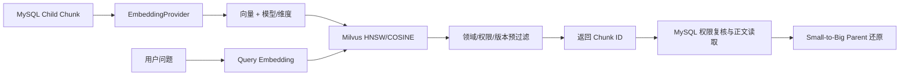
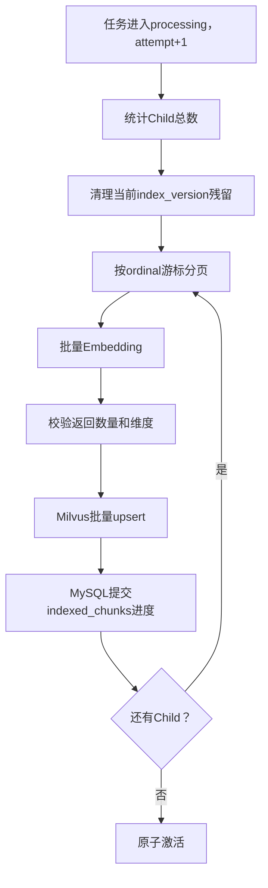

# 第 6 周：Embedding 与 Milvus 向量检索

> 本周只深入学习大模型与检索核心；安装、配置、SDK 适配、接口和测试脚手架由 Codex 自动完成。
> 本文统一记录本周目标、任务、代码阅读路径、思考题与答案。

## 1. 本周最终目标

把第 5 周产生的 Child Chunk 变成可检索向量，并建立一条可解释、可过滤、可评估的检索链路：



本周完成后应能回答：

- Embedding 把文本转换成了什么，为什么相似文本可以靠近？
- 余弦相似度、Top-K、向量维度、归一化分别影响什么？
- 为什么向量库不能代替 MySQL？
- 为什么检索前后都要处理权限？
- 如何用固定问题集衡量 Recall@K，而不是凭感觉判断效果？

## 2. 为什么从 FAISS 调整为 Milvus

FAISS 最初适合作为教学基线：没有服务依赖、代码少、精确检索容易理解，也方便用小数据验证
Embedding 是否有效。但 FAISS 持久化后留下的是本地索引文件，不是 Milvus 数据库；文件本身也不
提供企业平台需要的多实例服务、在线写入协调、标量过滤、访问控制边界、监控和扩缩容能力。

当前目标是完整商业化客服平台，因此直接采用 Milvus：

- 本地开发使用 Milvus Standalone，减少部署组件数量。
- 正式数据规模增大时可迁移 Milvus Distributed，业务层仍依赖相同 `VectorStore` 边界。
- Collection 使用 HNSW 索引和 COSINE 度量。
- 业务域、权限标签、文档版本作为标量字段参与检索前过滤。
- 使用 Session consistency，保证同一客户端写入后立即检索时可见。

这不是用 Milvus 替换所有数据库：

| 存储 | 职责 | 是否事实来源 |
|---|---|---|
| MySQL | 文档、版本、权限、Chunk 正文、任务状态 | 是 |
| Milvus | Child 向量和检索预过滤元数据 | 否 |
| MinIO | Milvus 内部对象数据 | 否 |
| etcd | Milvus 内部元数据协调 | 否 |

Milvus 命中后必须回 MySQL，执行权限复核、版本有效性检查和 Parent 正文还原。

## 3. 6A：Embedding 契约与 Milvus 边界（已完成）

### 学习目标

- 区分“Embedding 生成”和“向量存储/检索”两个职责。
- 用 Protocol 隔离真实模型、Mock 与 Milvus SDK。
- 理解向量维度是 Collection Schema 的一部分，不能随意改变。
- 理解标量过滤只是检索预过滤，不能取代事实库权限检查。

### 已实现内容

1. `EmbeddingRequest/Response/Vector`：约束批次、模型、超时、维度和有限浮点数。
2. `EmbeddingProvider`：业务代码依赖的异步协议。
3. `DeterministicHashEmbeddingProvider`：可复现、无需 API Key 的教学 Mock。
4. `VectorRecord/SearchQuery/SearchHit`：隔离 Milvus SDK 响应结构。
5. `VectorStore`：建集合、批量写入、过滤检索、按版本删除和关闭连接的协议。
6. `MilvusVectorStore`：同步 PyMilvus 调用转移到工作线程，避免阻塞事件循环。
7. Milvus Collection：
   - `chunk_id` 为主键；
   - 向量字段为 `FLOAT_VECTOR`；
   - HNSW + COSINE；
   - `business_domain`、`access_scope`、`version_id` 用于预过滤；
   - Session consistency 用于写后读。

### 代码阅读顺序

1. [embedding.py](../src/bili_support/knowledge/embedding.py)
   - 先读 `EmbeddingRequest` 和 `EmbeddingResponse`，理解契约。
   - 再读 `EmbeddingProvider`，理解为什么上层不依赖具体模型 SDK。
   - 最后读 `DeterministicHashEmbeddingProvider`，注意它是稳定 Mock，不是真实语义模型。
2. [vector_store.py](../src/bili_support/knowledge/vector_store.py)
   - 先读三个领域类型，再读 `VectorStore` Protocol。
   - 读 `_ensure_collection_sync`，观察 Schema 和 HNSW/COSINE 参数。
   - 读 `upsert`、`search`、`delete_version`，理解索引生命周期。
   - 最后读 `_milvus_filter` 与 `_parse_hit`，理解 SDK 隔离和安全过滤。
3. [config.py](../src/bili_support/core/config.py)
   - 查看 Embedding/Milvus 配置、范围校验和生产环境安全校验。
4. [compose.yaml](../compose.yaml)
   - 分清 Milvus、etcd、MinIO 以及 API 的依赖关系。
5. [test_embedding.py](../tests/unit/test_embedding.py) 和
   [test_milvus_vector_store.py](../tests/unit/test_milvus_vector_store.py)
   - 测试不是课程门禁，但可用它们观察契约边界与错误案例。

### Hash Mock 的边界

Hash Mock 把英文词、中文单字和相邻双字映射到固定维度，再做 L2 归一化。它的价值是：

- 同一输入始终得到同一向量，测试可重放。
- 不调用真实模型，不产生费用。
- 可以验证批处理、维度、存储、过滤和检索链路。

它不具备真实 Embedding 模型的深层语义理解，不能用它判断最终召回质量。本周后续会接入
OpenAI-compatible Embedding Provider，并用固定数据集比较。

## 4. 6B：批量索引与版本重建（已完成）

本模块按一条完整用例实现：

```text
已发布文档版本
→ 分页读取 Child Chunk
→ 按 embedding_batch_size 分批生成向量
→ 写入新index_version_id标记的Milvus记录
→ 记录模型、维度、数量与状态
→ 成功后切换活动版本
→ 旧版本标记superseded并延迟清理
```

重点学习：

- 为什么批量 Embedding 比逐条调用更高效。
- 为什么模型名、维度、Chunk 策略和知识版本必须进入索引版本。
- 为什么重建应先构建新版本再切换，不能原地清空线上索引。
- 如何处理部分失败、重试和幂等。

### 4.1 为什么不是“每个文档版本一个Collection”

Collection用于表达物理Schema版本，例如向量字段维度或标量字段发生变化。本次新增
`index_version_id`，因此从`bili_support_child_v1`升级到`bili_support_child_v2`，旧Collection
保留而不破坏。

普通文档重建不继续创建大量Collection，而是在v2 Collection内部使用不同
`index_version_id`隔离：

```text
bili_support_child_v2
├── index_version=A（superseded）
├── index_version=B（active）
└── index_version=C（building/failed，不允许检索）
```

这避免Collection数量随文档版本无限增长，也让检索可以跨多个文档的活动索引统一搜索。

### 4.2 MySQL新增的两个事实表

`knowledge_index_versions`保存：

- 来源文档版本；
- Collection、Provider、模型、维度和Chunk契约；
- build_key；
- building/active/superseded/failed状态；
- Child总数、已写入数量和激活时间。

`knowledge_index_jobs`保存：

- 当前构建任务；
- queued/processing/succeeded/failed状态；
- 尝试次数、开始/结束时间和稳定错误码。

向量库故障不能改变这些事实；部分向量即使短暂残留，也因为MySQL状态不是active而不会被使用。

### 4.3 build_key幂等

build_key由以下内容计算SHA-256：

```text
文档内容SHA
+ Embedding Provider
+ Embedding模型
+ 向量维度
+ Chunk契约版本
+ Collection名称
```

相同内容和配置重复请求直接复用已有索引。更换模型、维度、Chunk契约或物理Schema都会自然产生
新的索引版本。

### 4.4 批量构建链路



数据库事务只包围状态读取和进度提交。Embedding和Milvus网络调用不占用长事务。

### 4.5 安全切换

全部Child写入且`indexed_chunks == total_chunks`后，在同一MySQL事务中：

1. 同一逻辑文档旧的active索引改为superseded。
2. 新索引从building改为active。
3. 索引任务改为succeeded。

失败时新索引标记failed，旧active不受影响。重试复用同一个`index_version_id`，只清理该构建
残留，不调用按文档版本删除，避免误删线上向量。

### 4.6 代码阅读顺序

1. [entities.py](../src/bili_support/models/entities.py)：`KnowledgeIndexVersion`和
   `KnowledgeIndexJob`。
2. [vector_store.py](../src/bili_support/knowledge/vector_store.py)：观察
   `index_version_id`字段、过滤和精确删除。
3. [indexing.py](../src/bili_support/services/indexing.py)：先读`build/process`，再读
   `_write_batches/_activate/_mark_failed`。
4. [knowledge.py](../src/bili_support/repositories/knowledge.py)：Child游标分页和旧版下线查询。
5. [knowledge.py API](../src/bili_support/api/knowledge.py)：构建、状态、历史和重试接口。
6. [20260729_0005迁移](../migrations/versions/20260729_0005_week6_vector_indexes.py)：
   对照ORM理解数据库约束。

### 4.7 6B思考题与答案

**Q：为什么Embedding时不能一直保持一个数据库事务？**

答：模型和Milvus调用可能需要数秒甚至更久。长事务会长期占用连接和锁，并增加回滚成本。当前每批
在事务外计算和写Milvus，只用短事务提交进度。

**Q：为什么进度要记录Child数量，而不是Parent+Child？**

答：Small-to-Big中Child负责召回，Parent通过MySQL关系还原。Parent重复向量化会增加成本和重复
候选。

**Q：为什么旧向量不在激活时立即删除？**

答：活动状态切换和Milvus删除不能组成跨数据库原子事务。先用MySQL active ID隔离旧向量，可以
快速回滚并避免删除失败影响上线；物理清理由独立延迟任务完成。

**Q：如果写入第3批失败，前两批会不会被检索？**

答：不会。它们带新`index_version_id`，而MySQL中的索引仍是failed/building，不会进入活动索引
过滤列表。失败处理还会尽力删除该版本残留。

## 5. 6C：检索、过滤与 Small-to-Big（已完成）

已实现独立检索服务与调试接口：

```text
Standalone Query
→ Query Embedding
→ Milvus 领域/权限/版本过滤
→ Child Top-K
→ MySQL 二次权限复核
→ Parent 去重与批量还原
→ 返回得分、来源和过滤说明
```

重点学习 Top-K、阈值、Query Rewrite、权限过滤、Parent 聚合和上下文预算之间的取舍。

### 5.1 为什么检索前先访问MySQL

向量库中可能同时保留building、failed、active和superseded构建。检索服务先按当前知识运营身份、
业务域和权限范围读取MySQL，只把兼容当前Collection、模型和维度的active
`index_version_id`交给Milvus。

```text
MySQL active白名单
→ index_version_id IN [...]
→ Milvus搜索
```

如果没有活动索引，直接返回空结果，不调用Embedding和Milvus。

### 5.2 Query Rewrite

检索请求可以携带最多20条有界历史。现阶段复用保守的`StandaloneQueryRewriter`，只有高置信度
实体替换才改写，例如：

```text
历史：移动大王卡支持免流吗？
当前：那联通呢
结果：联通大王卡支持免流吗？
```

输出同时返回original、standalone、rewritten和reason，方便判断召回失败是否由改写造成。

### 5.3 Milvus预过滤

Milvus查询同时携带：

- `business_domain`；
- `allowed_scopes`；
- MySQL给出的`active index_version_ids`；
- COSINE Query向量；
- 过取后的Child Top-K。

当前按`child_top_k * 2`过取，上限100，为后续MySQL剔除过期或非法副本留出候选余量。过取但超出
用户请求Top-K的合法候选不算“丢弃”；只有事实复核失败才计入`discarded_child_count`。

### 5.4 为什么命中后还要回MySQL

Milvus响应中的document、version、scope和index字段都是冗余副本。服务按
`(chunk_id, index_version_id)`回MySQL重新验证：

1. 索引此刻仍为active；
2. 文档仍为active，版本仍为ready；
3. Chunk确实是Child且存在Parent；
4. 文档属于当前知识运营身份和业务域；
5. 当前权限与文档权限仍有交集；
6. document/version/index ID与Milvus响应一致。

测试专门注入了伪造`index_version_id`的Milvus Hit，最终被MySQL复核剔除。

### 5.5 Small-to-Big还原

合法Child按Milvus得分顺序交给`SmallToBigExpander`：

```text
Child Top-K
→ 同Child去重
→ 按Parent聚合
→ Parent按首次Child排名排序
→ Parent分数取所属Child最高分
→ 一次批量读取完整Parent
```

最终输出保留Parent正文、文档标题、文档/索引版本、触发它的Child ID、最高分和首次排名。

### 5.6 代码阅读顺序

1. [KnowledgeRetrievalRequest/View](../src/bili_support/schemas/knowledge.py)：请求和调试输出。
2. [retrieval.py](../src/bili_support/services/retrieval.py)：先读`retrieve`总流程。
3. 同文件`_active_targets`：理解检索前活动索引白名单。
4. 同文件`_validate_and_expand`：理解MySQL二次复核和Parent还原。
5. [vector_store.py](../src/bili_support/knowledge/vector_store.py)：观察
   `index_version_id`过滤和命中返回。
6. [knowledge.py Repository](../src/bili_support/repositories/knowledge.py)：
   活动索引查询、Child事实复核和跨版本Parent批量读取。
7. [knowledge.py API](../src/bili_support/api/knowledge.py)：`POST /knowledge/retrieve`。

### 5.7 6C思考题与答案

**Q：为什么不能直接把Milvus返回的正文交给大模型？**

答：Milvus不是权限和版本事实来源，而且当前只保存最小检索元数据。回MySQL既能复核权限，也能
读取可追踪的Parent正文。

**Q：为什么过滤要做两次？**

答：检索前过滤减少无权限候选并节省Top-K预算；检索后过滤防止副本延迟、状态切换和伪造字段。
前者优化效果和性能，后者保证正确性与安全。

**Q：为什么进入大模型的是Parent，不是命中的Child？**

答：Child较短，适合精确匹配问题；直接回答可能缺少条件、例外和完整步骤。Parent提供完整上下文，
而matched_child_ids保留“为什么召回它”的证据。

**Q：当前allowed_scopes为什么仍由接口传入？**

答：该接口是知识运营调试入口，并且只查询当前运营身份创建的文档。正式客服接线时，权限必须由
受信任的SSO/租户上下文生成，不能相信终端用户请求体中的自报权限。

**Q：6C为什么暂时不做相似度阈值？**

答：阈值必须根据6D Golden Dataset的Recall、误召回和分数分布校准，不能凭经验写死。当前返回
原始COSINE分数供评估。

## 6. 6D：固定检索集与 Recall@K

建立首批 Golden Dataset，每条样本至少包含：

- 用户问题；
- 预期命中的 Child/Parent；
- 业务域与权限；
- 允许命中的文档版本；
- 边界样本和不应命中的负例。

输出 Recall@1、Recall@3、Recall@5、延迟分位数和失败样本。测试脚手架自动运行，但学习重点是
阅读失败：是 Query 表达、Embedding、Chunk、过滤、Top-K，还是标注本身有问题。

## 7. 本模块思考题与答案

### Q1：为什么业务代码依赖 `EmbeddingProvider`，而不是直接调用模型 SDK？

答：协议把业务语义与供应商 SDK 隔离。真实云模型、本地模型和确定性 Mock 都可以实现同一契约；
更换模型时索引服务不需要跟着重写，也更容易统一超时、批次、维度和错误处理。

### Q2：为什么更换 Embedding 模型通常要重建 Collection？

答：不同模型的维度和向量空间不一定相同。即使维度碰巧一致，不同模型的坐标含义也不同，旧文档
向量与新查询向量不可直接比较。应创建带版本的新 Collection，完整重建后再切换。

### Q3：为什么使用 COSINE？

答：客服语义检索更关心向量方向而非长度。余弦相似度衡量方向接近程度；对已归一化向量，它与
内积排序等价且容易解释。最终选择仍应通过固定数据集评估。

### Q4：为什么选择 HNSW，而不是精确全量扫描？

答：HNSW 用图结构换取更低查询延迟，适合在线客服的近似最近邻检索；`M`、`efConstruction` 和
检索 `ef` 在内存、构建耗时、延迟与召回率之间取舍。参数需要用真实规模数据校准。

### Q5：Milvus 已有权限过滤，为什么还要回 MySQL 复核？

答：Milvus 中的权限字段是为了减少无权限候选的冗余副本，可能存在同步延迟；MySQL 才是权限和
版本事实来源。安全决策不能只依赖检索副本。

### Q6：为什么本地使用 Session consistency？

答：索引任务写入后常需要立即冒烟检索。Session consistency 保证同一客户端能看到自己的写入，
同时避免所有请求都使用更昂贵的强一致性。生产值仍要结合读写模式评估。

## 8. 当前结论

第6周6A、6B、6C已完成：Embedding边界、Milvus Schema、Child批量构建、活动索引安全切换、
Query Rewrite、权限过滤、MySQL二次复核和Parent还原均已具备。真实检索返回5个Child和3个
Parent，Top-1 COSINE为1.0。Recall@K、延迟分位数和失败样本分析属于6D。
