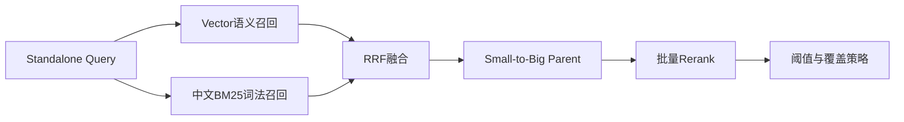
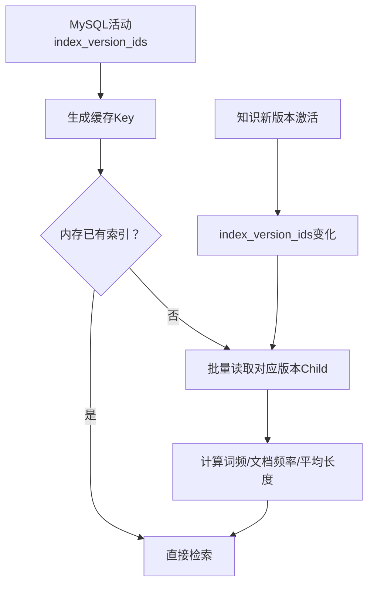
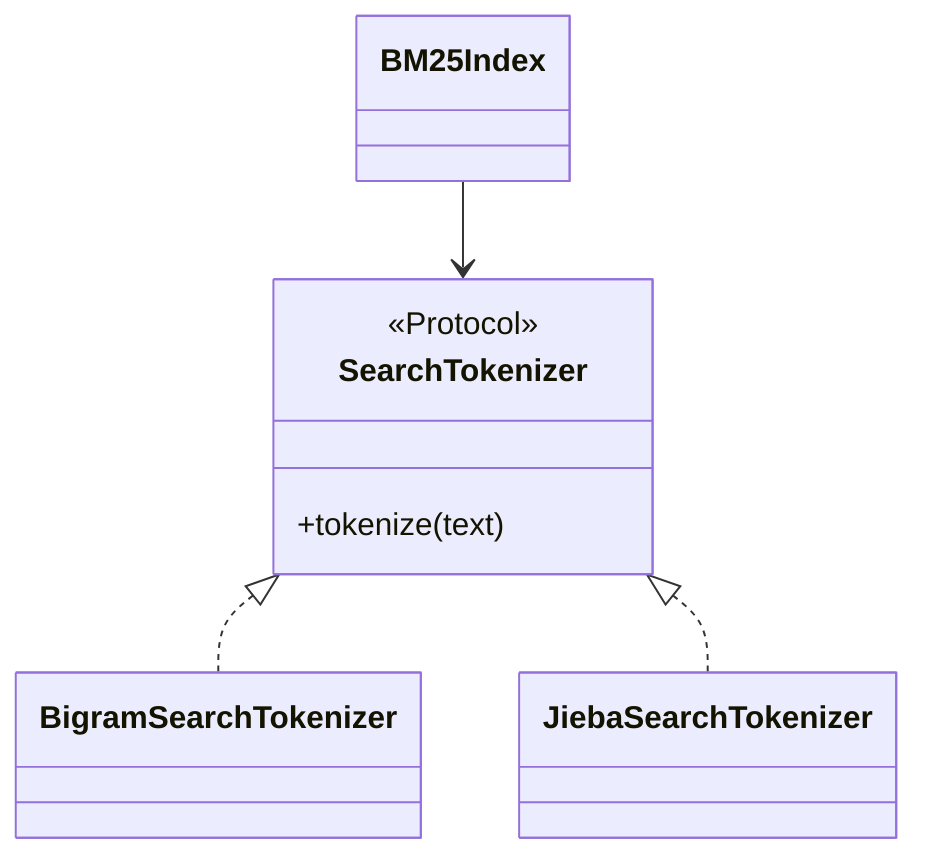
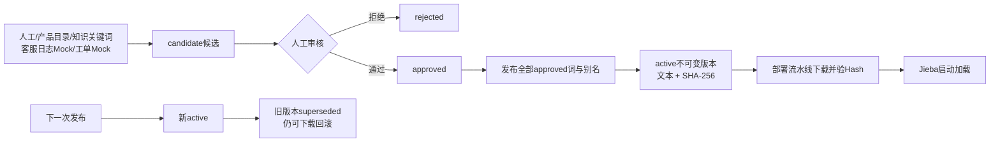
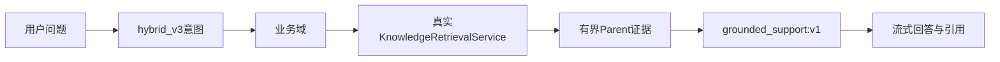
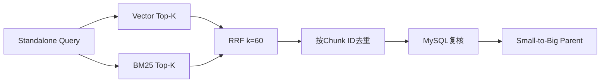
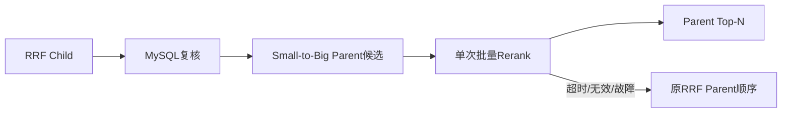
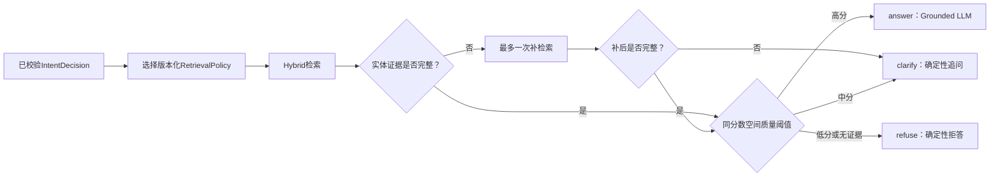
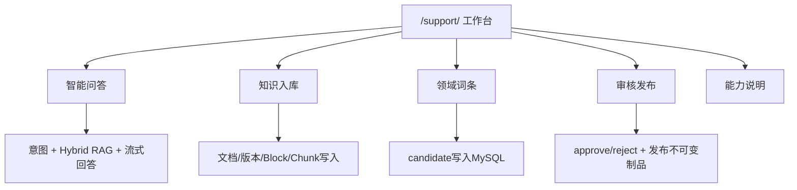

# 第 7 周：混合检索、Rerank 与策略

> 本周继续聚焦检索质量：先建立BM25词法基线，再做RRF融合、Parent Rerank、阈值和多实体覆盖。
> 普通接口、缓存和报告脚手架由Codex完成；学习重点是理解不同召回器的互补性和评估结果。

## 1. 本周目标



| Step | 内容 | 状态 |
|---|---|---|
| 7A | 中文Tokenizer与BM25单路基线 | 已完成 |
| 7B | Vector + BM25 RRF融合 | 已完成 |
| 7C | Parent批量Rerank与失败降级 | 已完成 |
| 7D | RetrievalPolicy、阈值和多实体覆盖 | 已完成 |

## 2. 7A：中文Tokenizer与BM25单路基线（已完成）

### 2.1 为什么向量检索之外还需要BM25

向量检索擅长同义表达和语义接近，例如“钱扣了但会员没显示”与“支付成功未到账”。BM25擅长
精确词、订单号、UID、产品名、错误码和专有名词。两者不是替代关系：

| 问题 | Vector | BM25 |
|---|---|---|
| 同义改写 | 较强 | 依赖词面重叠 |
| UID、错误码、套餐名 | 可能被稀释 | 较强 |
| 无答案问题 | 仍可能强制返回Top-K | 有通用词重叠也可能误召回 |
| 原始分数 | COSINE | Okapi BM25 |

COSINE与BM25分数没有共同量纲，7B不能直接相加，必须使用RRF等基于排名的融合。

### 2.2 中文Tokenizer

[bm25.py](../src/bili_support/knowledge/bm25.py)中的`ChineseSearchTokenizer`组合两类Token：

1. 领域词：`大会员`、`连续包月`、`自动续费`、`未到账`等；
2. 中文相邻二元组：即使新词没有进入词典，也能通过局部字面重叠召回。

示例：

```text
输入：卸载客户端后还会自动续费吗

领域词：
客户端、自动续费

二元组：
卸载、载客、客户、户端、端后、还会、自动、动续、续费……
```

7A刻意不做同义词Query Expansion，保证当前指标是纯词法基线；受审核的同义词扩展留给后续步骤。

### 2.3 BM25公式直觉

单个查询词的贡献由三部分决定：

```text
词在当前Child中出现次数
× 词在整个语料中的稀有程度
÷ 文档长度归一化
```

常见词的区分度较低；只在少量Child出现的“支付流水”“无理由退款”权重更高。代码使用Okapi
BM25常见参数`k1=1.2`、`b=0.75`，但它们只是首版基线，后续必须通过固定集比较后再调整。

### 2.4 索引生命周期



文档版本和Chunk不可变，因此以活动索引版本集合为缓存Key是安全的。新索引激活后Key变化，
自然构建新BM25语料。当前最多缓存8组，适合本地单进程MVP；大规模多实例部署应替换为
OpenSearch等外部词法索引，但上层候选契约不变。

### 2.5 与6C安全链路复用

BM25只改变“候选从哪里来”，不绕过安全边界：

```text
活动索引与权限筛选
→ BM25 Child候选
→ MySQL二次校验active/ready/owner/domain/scope
→ Small-to-Big恢复Parent
```

统一候选类型位于[retrieval.py](../src/bili_support/knowledge/retrieval.py)，每个候选保留
`source=vector|bm25`。调试接口通过`retrieval_mode`选择单路：

```json
{
  "query": "卸载客户端还会自动续费扣钱吗？",
  "business_domain": "membership",
  "allowed_scopes": ["public"],
  "retrieval_mode": "bm25",
  "child_top_k": 10,
  "parent_top_k": 5
}
```

### 2.6 真实固定集对比

同一份10条Golden Dataset、同一批活动知识得到：

| 通道 | Recall@1 | Recall@3 | Recall@5 | MRR@5 | 负例准确率 | P50 | P95 |
|---|---:|---:|---:|---:|---:|---:|---:|
| Vector Hash Mock | 75.00% | 87.50% | 100.00% | 84.38% | 50.00% | 11.20ms | 29.24ms |
| BM25 | 62.50% | 100.00% | 100.00% | 77.08% | 50.00% | 7.81ms | 43.74ms |

报告：

- [Vector报告](../data/evaluation/retrieval_vector_report_v1.md)
- [BM25报告](../data/evaluation/retrieval_bm25_report_v1.md)

解读：

- Vector首位排序和MRR更好；
- BM25在Top-3内找全8条正例，并且热请求更快；
- 两路Recall@5均为100%，说明当前10条正例不能证明融合一定提高Recall，需要扩充困难表达；
- 两路都误召回“演唱会门票”负例：Vector会返回最近邻，BM25会被“购买”等通用词触发；
- 7B的价值首先是建立可靠融合结构和更强排序证据，拒答问题仍需7D用阈值和覆盖策略解决。

### 2.7 运行方式

```powershell
.\.venv\Scripts\python.exe -m bili_support.evaluation.retrieval_cli `
  --mode bm25 `
  --user-id demo-user `
  --user-name "Demo User" `
  --output-prefix data/evaluation/retrieval_bm25_report_v1
```

### 2.8 代码阅读顺序

1. [knowledge/retrieval.py](../src/bili_support/knowledge/retrieval.py)：统一候选与来源；
2. [knowledge/bm25.py](../src/bili_support/knowledge/bm25.py)：Tokenizer、索引和公式；
3. [repositories/knowledge.py](../src/bili_support/repositories/knowledge.py)：活动版本Child批量读取；
4. [services/retrieval.py](../src/bili_support/services/retrieval.py)：模式选择、缓存和统一复核；
5. [evaluation/retrieval_runner.py](../src/bili_support/evaluation/retrieval_runner.py)：同一固定集切换通道。

### 2.9 思考题与答案

**Q：为什么BM25有匹配词仍然可能答错？**

答：词面重叠只证明共享词汇，不证明问题意图和答案事实一致。“购买演唱会门票”与会员文档都包含
“购买”，因此可能产生弱匹配。最终还需要融合、Rerank、覆盖和拒答策略。

**Q：为什么BM25不需要Embedding模型和Milvus？**

答：BM25基于离散Token的词频、文档频率和长度计算相关性，不在连续向量空间中搜索。

**Q：为什么不把COSINE 0.8和BM25 8.0直接加权？**

答：两者的数值范围和含义完全不同，并且随语料和模型变化。直接相加会让某一路因尺度更大而支配
结果；RRF只使用各通道内部排名，更稳定。

**Q：为什么BM25命中后仍回MySQL？**

答：BM25内存索引同样是检索副本。文档可能下线、权限可能变化、活动索引可能切换，最终事实仍由
MySQL复核。

### 2.10 7A-2：Jieba搜索分词优化（已完成）

原二元分词可以覆盖未登记新词，但会产生“载客、户端”等无业务意义的Token。7A-2把BM25改为
依赖`SearchTokenizer`协议，保留`bigram`基线，并新增默认的`jieba`实现：



[tokenizers.py](../src/bili_support/knowledge/tokenizers.py)使用独立`jieba.Tokenizer`实例，避免全局词典
被测试或其他模块污染；中文调用搜索模式，英文、数字和UID保持完整。HMM默认关闭，业务词汇由
[bilibili_support.txt](../data/dictionaries/bilibili_support.txt)控制，例如“大会员、连续包月、自动续费、
支付流水、账号申诉、创作激励”。

```dotenv
BILI_SUPPORT_BM25_TOKENIZER=jieba
BILI_SUPPORT_BM25_JIEBA_HMM_ENABLED=false
BILI_SUPPORT_BM25_USER_DICTIONARY_PATH=./data/dictionaries/bilibili_support.txt
```

同一份8正2负固定集结果：

| 链路 | 分词器 | Recall@1 | Recall@3 | Recall@5 | MRR@5 | 负例准确率 |
|---|---|---:|---:|---:|---:|---:|
| BM25 | Bigram | 62.50% | 100.00% | 100.00% | 77.08% | 50.00% |
| BM25 | Jieba | 75.00% | 87.50% | 87.50% | 79.17% | 50.00% |
| Hybrid | Bigram | 75.00% | 100.00% | 100.00% | 85.42% | 50.00% |
| Hybrid | Jieba | 87.50% | 100.00% | 100.00% | 91.67% | 50.00% |

结论不是“Jieba所有场景都更好”：纯BM25的Top-5下降，因为“钱已经付了”和“支付成功”没有词面
重叠，分词器不能自动完成同义词扩展；但正式客服使用Hybrid，Vector补上语义表达后，Jieba让
Recall@1提高12.5个百分点、MRR@5提高6.25个百分点，因此正式默认切换为Jieba，Bigram继续作为
回归基线。

更换分词器后，演唱会负例Hybrid分数从`0.028372`变为`0.029116`。沿用策略v1会从拒答变成澄清，
因此发布`membership-query-v2`，把澄清线从`0.029`提升为`0.0295`。v2在两种分词器上均得到：

| 决策准确率 | 回答精确率 | 错误回答率 | 负例拒答召回 |
|---:|---:|---:|---:|
| 100% | 100% | 0% | 100% |

对照报告：

- [BM25 Bigram](../data/evaluation/retrieval_bm25_bigram_report_v1.md)
- [BM25 Jieba](../data/evaluation/retrieval_bm25_jieba_report_v1.md)
- [Hybrid Bigram](../data/evaluation/retrieval_hybrid_bigram_report_v1.md)
- [Hybrid Jieba](../data/evaluation/retrieval_hybrid_jieba_report_v1.md)
- [策略 Bigram v2](../data/evaluation/retrieval_policy_bigram_report_v2.md)
- [策略 Jieba v2](../data/evaluation/retrieval_policy_jieba_report_v2.md)

评估CLI可用`--bm25-tokenizer bigram|jieba`切换实现。分词器变化会改变BM25文档长度、词频、候选
排名和RRF输入，因此必须同时重跑召回与最终回答门禁，不能只观察几个分词示例。

### 2.11 7A-3：生产级领域词典管理（已完成）

静态文本词典无法说明词来自哪里、谁审核、何时发布，也不能安全回滚。7A-3增加管理库与发布流程，
但保持在线检索路径简单：管理面负责产生不可变制品，Tokenizer只在实例启动时读取已部署文件。



#### 数据模型

[entities.py](../src/bili_support/models/entities.py)新增：

- `knowledge_dictionary_terms`：词、规范词、别名、业务域、类型、频率、来源、审核状态、创建人与审核人；
- `knowledge_dictionary_versions`：版本号、状态、完整Jieba文本、SHA-256、词数、发布人与说明。

同一业务域内`normalized_term`唯一。候选状态只能单向进入`approved`或`rejected`，审核完成后不能
原地改写；变更含义应创建新词或走后续修订流程，避免历史审计被覆盖。

发布版本不是指向可变词条的简单关系，而是保存完整文本快照。即使以后词条表发生变化，历史版本仍能
产生完全相同的Token结果。相同内容重复发布会幂等复用当前版本；内容变化生成递增版本，并将旧active
标记为`superseded`。

#### 候选来源边界

当前支持：

| 来源 | 是否真实接入 | 说明 |
|---|---|---|
| `manual` | 是 | 运营人员人工提交 |
| `knowledge_keyword` | 接口契约已留 | 后续从已审核文档关键词提取 |
| `product_catalog` | 接口契约已留 | 后续连接产品主数据 |
| `conversation_log_mock` | Mock | 模拟用户会话候选，不连接真实日志 |
| `ticket_mock` | Mock | 模拟客服工单候选，不连接真实工单系统 |

Mock导入只能产生`candidate`，不能自动批准或发布。真实会话中可能包含UID、订单号、手机号、注入文本
和恶意重复内容，因此未来接入前还必须增加PII清洗、聚合阈值和来源权限。

#### 管理API

[dictionary.py](../src/bili_support/api/dictionary.py)提供：

```text
POST /api/v1/knowledge/dictionary/terms
POST /api/v1/knowledge/dictionary/candidates/mock
GET  /api/v1/knowledge/dictionary/terms
POST /api/v1/knowledge/dictionary/terms/{term_id}/review
POST /api/v1/knowledge/dictionary/versions/publish
GET  /api/v1/knowledge/dictionary/versions
GET  /api/v1/knowledge/dictionary/versions/active/artifact
GET  /api/v1/knowledge/dictionary/versions/{version_id}/artifact
```

HTTP层只转换输入和包装响应；[services/dictionary.py](../src/bili_support/services/dictionary.py)执行状态机
和事务，[repositories/dictionary.py](../src/bili_support/repositories/dictionary.py)负责查询。

#### 发布制品如何进入生产Tokenizer

当前刻意不让每次用户查询访问词典数据库，也不在管理请求完成后热修改进程内Jieba对象：

```text
发布API → 获取active artifact和SHA-256
→ 部署流水线保存为版本化文件
→ 校验SHA-256
→ 更新BILI_SUPPORT_BM25_USER_DICTIONARY_PATH
→ 灰度重启实例 → 固定集/监控 → 全量发布
```

回滚时部署历史版本制品并重启即可。该边界避免不同实例在同一时刻使用不同的内存词典，也让词典版本、
检索报告和线上问题可以关联。当前鉴权仍是学习项目的统一管理Token；商业生产必须再增加运营人员、
审核人和发布人的RBAC及双人审批。

#### 思考题与答案

**Q：为什么approved词不直接让Jieba热加载？**

答：审核通过不等于已发布。直接热加载会导致实例之间版本漂移，也绕过固定集、灰度和回滚。发布制品
把多个审核词组成一次可审计变更。

**Q：为什么版本表保存完整文本，而不只保存词条ID？**

答：词条记录未来可能被修订。完整快照和哈希才能保证历史评估可复现，并允许部署流水线直接下载。

**Q：为什么真实日志候选不能自动批准？**

答：日志可能含PII、错别字、攻击文本和短期热点。自动发布会把输入污染放大到所有检索请求；模型也
只能辅助生成候选，最终需要受权人员和离线指标共同批准。

## 3. Chat接入真实RAG（已完成）

7A完成后，独立`/knowledge/retrieve`已经真实可用，但正式Chat仍把普通业务请求路由到
`knowledge_mock`并调用通用Prompt。现在链路已经改为：



### 3.1 路由和权限

普通低风险`supported`请求进入`knowledge_rag`，不再标记Mock。业务域来自已校验的
`IntentDecision`；第一版权限范围由服务端固定生成`public`，Chat请求体不能自报管理员权限。
高风险、分类失败、澄清、安全拦截和人工转接仍保持原有短路逻辑。

### 3.2 证据契约

[evidence.py](../src/bili_support/knowledge/evidence.py)负责：

- 跨业务域按Parent ID去重；
- 最多保留5个Parent；
- 单Parent最多2000字符，总证据最多6000字符；
- 生成`E1`、`E2`等真实引用编号；
- 页面只展示文档标题、版本、Parent ID和分数，不暴露向量与文件路径。

证据用JSON作为数据传入Prompt。系统消息明确声明知识内容是不可信数据，不能把文档中的提示注入
当成指令执行。

### 3.3 无证据与故障边界

```text
有Parent → grounded_support:v1 → 真实模型回答
无Parent → 确定性“证据不足”回复，不调用自由模型
检索故障 → 确定性“知识服务不可用”回复，Trace记录稳定错误码
```

因此即使通用回答模型可用，也不能在缺少知识证据时凭模型记忆编造会员规则。

### 3.4 页面与审计

SSE首个`route`事件现在包含：

- `target=knowledge_rag`；
- 业务域；
- 检索模式；
- Child命中数和证据数；
- 实际引用来源；
- 安全的检索错误码。

页面同时展示意图分类失败的稳定错误码，避免把Provider/Schema失败误解为业务高风险。
`model_calls.operation`记录`complete:knowledge_rag`或`stream:knowledge_rag`，Grounded调用记录
`grounded_support:v1`。

### 3.5 真实验收

问题`会员权益说明`在固定已知意图后使用当前真实MySQL、Milvus和大模型完成隔离验收：

```text
target=knowledge_rag
mode=vector
evidence_count=3
source=大会员开通说明
prompt=grounded_support:v1
answer引用=[E1][E2][E3]
```

真实意图Provider另有偶发结构化失败，失败时会在进入RAG前安全转`human_review_mock`；这属于
意图Provider可靠性问题，不应与后半段RAG能力混为一谈。

### 3.6 阅读顺序

1. [routing.py](../src/bili_support/routing.py)：`supported`到`knowledge_rag`；
2. [evidence.py](../src/bili_support/knowledge/evidence.py)：证据预算、引用和Trace；
3. [conversations.py](../src/bili_support/services/conversations.py)：先检索再生成；
4. [prompts.py](../src/bili_support/llm/prompts.py)：`grounded_support:v1`；
5. [support.py](../src/bili_support/ui/support.py)：页面检索摘要和来源。

## 4. 7B：Vector + BM25 RRF融合（已完成）

### 4.1 完成目标

新增`hybrid`检索模式，并行获得Vector与BM25 Child排名。融合层按Chunk ID去重，使用
Reciprocal Rank Fusion计算统一顺序，不直接混加COSINE和Okapi BM25原始分数。融合后继续复用
MySQL二次复核与Small-to-Big，不因增加召回器而复制安全和Parent恢复逻辑。



### 4.2 融合公式与可解释证据

每个候选在一条通道中的贡献为`1 / (60 + rank)`，多路贡献相加得到`fused_score`。实现位于
[fusion.py](../src/bili_support/knowledge/fusion.py)。结果保留`channel_evidence`：来源、通道内排名、
原始分数和RRF贡献。原始分数只用于解释，不参与跨通道计算。

同分时依次使用最佳单路排名和Chunk ID，保证固定输入产生确定性顺序。同一通道重复Chunk只接受
第一次；相同Chunk ID若携带冲突的文档或版本身份则拒绝融合，避免错误合并。

### 4.3 在线服务与降级

[retrieval.py](../src/bili_support/services/retrieval.py)在`hybrid`模式并行执行两路召回：

- 两路成功：输出`source=hybrid`和完整`channel_evidence`；
- 一路失败：使用成功通道，设置`degraded=true`并记录`failed_sources`，不伪装成完整融合；
- 一路为空：仍视为正常结果，不等同于系统故障；
- 两路失败：抛出稳定的服务未就绪错误；
- 所有候选：仍必须通过活动版本、所有者、业务域和权限复核。

Chat默认检索模式已切换为`hybrid`，也可以通过
`BILI_SUPPORT_CUSTOMER_RETRIEVAL_MODE=vector|bm25|hybrid`显式选择。

### 4.4 固定集结果

同一份8正2负数据集的三路结果：

| 通道 | Recall@1 | Recall@3 | Recall@5 | MRR@5 | 负例准确率 | P50 | P95 |
|---|---:|---:|---:|---:|---:|---:|---:|
| Vector Hash Mock | 75.00% | 87.50% | 100.00% | 84.38% | 50.00% | 11.20ms | 29.24ms |
| BM25 | 62.50% | 100.00% | 100.00% | 77.08% | 50.00% | 7.81ms | 43.74ms |
| Hybrid RRF | 75.00% | 100.00% | 100.00% | 85.42% | 50.00% | 14.15ms | 57.57ms |

Hybrid保持Vector的Recall@1，把Recall@3提升12.5个百分点，并将MRR@5提升约1.04个百分点；双路
工作带来更高延迟。负例准确率没有改善，“演唱会门票”仍因通用词重叠产生误召回，这一问题不能
靠RRF解决，留给7D的阈值、域外判断和覆盖策略。

报告：[Hybrid Markdown](../data/evaluation/retrieval_hybrid_report_v1.md)和
[Hybrid JSON](../data/evaluation/retrieval_hybrid_report_v1.json)。

### 4.5 代码阅读顺序

1. [retrieval.py](../src/bili_support/knowledge/retrieval.py)：Hybrid枚举、融合候选和通道证据；
2. [fusion.py](../src/bili_support/knowledge/fusion.py)：纯RRF算法、去重和稳定排序；
3. [services/retrieval.py](../src/bili_support/services/retrieval.py)：并行召回、单路降级和统一复核；
4. [schemas/knowledge.py](../src/bili_support/schemas/knowledge.py)：API中的融合Trace；
5. [test_retrieval_fusion.py](../tests/unit/test_retrieval_fusion.py)：用小排名表验证公式不依赖原始分数；
6. [retrieval_runner.py](../src/bili_support/evaluation/retrieval_runner.py)：同一固定集切换三种模式。

### 4.6 思考题与答案

**Q：为什么RRF融合后仍保留原始分数？**

答：原始分数不能跨通道计算，但对调试很重要。它能说明候选在各自召回器中的强弱，也为后续
按领域调参、分析异常和引入Rerank提供证据。

**Q：为什么某一路为空不标记为降级？**

答：空结果是正常业务结果，表示该召回器没有找到候选；降级专指依赖发生异常。混淆两者会让
监控把“没有匹配知识”误报为系统故障。

**Q：RRF为什么仍然无法正确拒答演唱会问题？**

答：RRF只重新排列已有候选，不判断候选是否足够相关。只要BM25存在通用词重叠或Vector返回
最近邻，RRF仍可能保留它们；拒答需要7D的质量阈值和域外策略。

**Q：为什么融合后仍需要MySQL复核？**

答：Milvus与BM25都是检索副本，可能存在下线延迟或旧缓存。MySQL才是活动版本、所有权、业务域和
权限的事实源，融合不能扩大候选的可信边界。

## 5. 7C：Parent批量Rerank与失败降级（已完成）

### 5.1 为什么在Parent阶段重排

Child适合精细召回，但最终进入Prompt的是完整FAQ或条款Parent。7C先完成RRF Child融合和MySQL
复核，再恢复最多10条Parent；数据库事务提交后，一次性把问题和全部Parent交给Reranker，最终
截取5条。外部模型等待期间不占用数据库连接。



### 5.2 Provider与结构化输出

[reranking.py](../src/bili_support/knowledge/reranking.py)定义Provider无关的Request、Response、
Trace和错误码；[rerank_providers.py](../src/bili_support/knowledge/rerank_providers.py)实现：

- `MockRerankProvider`：Token覆盖率确定性排序，只验证管线；
- `LLMRerankProvider`：复用OpenAI-compatible Provider和严格JSON Schema，一次生成全部评分。

响应必须完整覆盖输入Parent ID，不能新增、遗漏或重复；排名必须连续，按排名观察到的分数不能
上升。Parent正文按总计8000字符预算平均截断，最多20个候选。知识正文被标记为不可信数据，
Prompt明确禁止执行其中的指令。

### 5.3 成功与失败语义

成功时Parent同时保留：

- `pre_rerank_rank`：RRF恢复Parent后的原始顺序；
- `rerank_rank`：模型重排顺序；
- `rerank_score`：真实Provider分数。

超时、Provider异常、非法JSON或ID契约失败时：

- `applied=false`、`degraded=true`并记录稳定`error_code`；
- Parent顺序原样回退RRF；
- `rerank_rank`和`rerank_score`保持`null`，绝不伪造增强结果；
- `CancelledError`继续向上传播，不被误当普通降级。

并发通过应用级Semaphore限制，避免高流量时无限放大外部模型请求。

### 5.4 配置与当前默认值

```dotenv
BILI_SUPPORT_RERANK_PROVIDER=mock
BILI_SUPPORT_RERANK_MODEL=mock-reranker-v1
BILI_SUPPORT_RERANK_TIMEOUT_SECONDS=10
BILI_SUPPORT_RERANK_MAX_CONCURRENCY=4
BILI_SUPPORT_RERANK_CANDIDATE_K=10
BILI_SUPPORT_CUSTOMER_RERANK_ENABLED=false
```

调试接口可用`rerank_enabled=true`显式开启。正式Chat当前保持关闭；只有真实模型固定集确认无质量
回退后，才考虑设置`CUSTOMER_RERANK_ENABLED=true`。

### 5.5 Mock固定集结果

| 实验 | Recall@1 | Recall@3 | Recall@5 | MRR@5 | 负例准确率 | Rerank降级率 |
|---|---:|---:|---:|---:|---:|---:|
| Hybrid RRF | 75.00% | 100.00% | 100.00% | 85.42% | 50.00% | 不适用 |
| Hybrid + Mock Rerank | 75.00% | 87.50% | 100.00% | 83.75% | 50.00% | 0.00% |

Mock成功验证了批量契约和零降级接线，但让Recall@3回退12.5个百分点、MRR@5回退约1.67个百分点。
根因是简单Token覆盖率不是语义相关性模型。结论是保持正式Chat关闭Mock Rerank，而不是为了展示
功能强行启用。真实LLM评估最多10次调用，必须另行得到明确许可。

报告：[Mock Rerank Markdown](../data/evaluation/retrieval_hybrid_rerank_mock_report_v1.md)和
[Mock Rerank JSON](../data/evaluation/retrieval_hybrid_rerank_mock_report_v1.json)。

### 5.6 代码阅读顺序

1. [reranking.py](../src/bili_support/knowledge/reranking.py)：批量请求、响应、Trace和严格复核；
2. [rerank_providers.py](../src/bili_support/knowledge/rerank_providers.py)：Mock与LLM适配；
3. [prompts.py](../src/bili_support/llm/prompts.py)：`parent_rerank:v1`注入边界；
4. [services/retrieval.py](../src/bili_support/services/retrieval.py)：事务外调用、超时和RRF回退；
5. [schemas/knowledge.py](../src/bili_support/schemas/knowledge.py)：API Parent分数和Rerank Trace；
6. [retrieval_runner.py](../src/bili_support/evaluation/retrieval_runner.py)：开关式对照评估。

### 5.7 思考题与答案

**Q：为什么Rerank候选数量要大于最终Parent数量？**

答：如果在Rerank前就只保留5条，被RRF排在第6至10名但语义更相关的Parent没有机会被提升。先取
10条再选5条，才能让重排真正改变候选选择。

**Q：为什么Reranker失败不能返回默认0分？**

答：0分会伪装成模型真实判断，污染阈值、评估和审计。失败时应保留RRF分数与顺序，并把Rerank
分数设为null。

**Q：为什么Mock指标下降仍认为7C实现完成？**

答：7C的工程目标是建立可替换Provider、批量调用、严格输出和可靠降级。Mock明确不代表模型质量；
指标下降反而验证了上线开关必须由真实评估控制。真实模型效果是下一次受控实验的问题。

**Q：Rerank能否解决演唱会门票负例？**

答：它可能降低无关Parent的分数，但7C仍会返回Top-N。根据分数决定回答、澄清或拒答属于7D
RetrievalPolicy与阈值校准。

## 6. 7D：RetrievalPolicy、阈值与多实体覆盖（已完成）

### 6.1 这一阶段解决什么问题

Top-K检索一定会尽量返回“最像”的候选，但“最像”不代表“足够可信”。7D在检索与回答模型之间
增加确定性策略层，将一次召回转换为三种动作：



回答模型只在`answer`分支出现。`clarify`和`refuse`均使用确定性文本，不会让模型依据弱证据自由发挥。

### 6.2 版本化策略与不同分数空间

[retrieval_policy.py](../src/bili_support/knowledge/retrieval_policy.py)定义策略、阈值和决策契约。
注册表按照以下优先级选择：

1. 业务域 + 动作，例如`membership + query`；
2. 业务域默认策略；
3. 全局保守策略。

当前会员策略为`membership-query-v2`。它保存Child预算、Parent候选预算、最终证据预算、是否
Rerank、补检索次数和各分数空间的阈值。Vector COSINE、Okapi BM25、Hybrid RRF和Rerank分数
含义不同，因此各自使用`ThresholdBand`，禁止拿同一个数字跨通道判断。

当前线上默认Hybrid阈值来自第7周Bigram/Jieba对照固定集：

```text
score >= 0.030          → answer
0.0295 <= score < 0.030 → clarify
score < 0.0295          → refuse
```

它是`v2`开发集基线，不是永远正确的常数。更换Embedding、RRF参数、Reranker或知识语料后，必须
重新评估并发布新策略版本，不能静默覆盖旧阈值。

### 6.3 多实体覆盖与一次补检索

[coverage.py](../src/bili_support/knowledge/coverage.py)只接受两类受控实体：意图模型已校验的
`PRODUCT`实体，以及代码中审核过的产品词典。它不会把模型随意生成的订单号等敏感文本当成检索
策略配置。

例如“比较连续包月和年度套餐的价格”要求证据同时覆盖两个对象：

```text
required = [连续包月, 年度套餐]
首次证据只覆盖连续包月
missing = [年度套餐]
补充查询 = 原问题 + “重点检索对象：年度套餐”
```

[query_expansion.py](../src/bili_support/knowledge/query_expansion.py)把所有缺失对象合并为一个补充查询，
策略限制最多调用一次。补检索结果也必须达到当前分数空间的澄清线，否则不会把低质量证据强行
合并。补后仍缺项时返回明确追问，而不是生成不完整比较结论。

### 6.4 在线编排与隐私边界

[policy_retrieval.py](../src/bili_support/services/policy_retrieval.py)包装现有
`KnowledgeRetrievalService`，复用活动版本、权限、MySQL复核和Small-to-Big安全链路。它只负责编排：

```text
选择策略 → 首次检索 → 覆盖检查 → 可选补检索 → 覆盖优先排序 → 质量决策
```

[routing.py](../src/bili_support/routing.py)把完整`IntentDecision`放进服务器内部执行计划，并通过
Pydantic的`exclude=True`阻止它进入API响应，避免订单号、账号ID等实体泄露。公开Trace只包含策略
ID、版本、动作、稳定原因码、分数类型和分数。

[conversations.py](../src/bili_support/services/conversations.py)执行最终门禁：

- `answer`：构建有界证据并调用`grounded_support:v1`；
- `clarify`：返回策略生成的追问，模型调用次数为0；
- `refuse`：返回证据不足提示，模型调用次数为0；
- 多业务域问题选择最保守动作，拒答优先于澄清，澄清优先于回答。

### 6.5 页面可解释信息

[support.py](../src/bili_support/ui/support.py)在既有检索摘要上增加：

- 策略ID与策略版本；
- 最终`answer / clarify / refuse`动作及原因码；
- 实体覆盖数量、缺失对象；
- 是否使用过一次补检索。

页面不显示完整内部意图实体、阈值表、文件路径或Provider异常原文。

### 6.6 策略评估

策略评估复用6D的8正2负固定集，但评价目标从“是否召回Top-K”变成“是否应该允许回答”。报告位于
[retrieval_policy_jieba_report_v2.md](../data/evaluation/retrieval_policy_jieba_report_v2.md)：

| 决策准确率 | 回答精确率 | 错误回答率 | 负例拒答召回 | 执行失败率 |
|---:|---:|---:|---:|---:|
| 100% | 100% | 0% | 100% | 0% |

其中8条会员FAQ通过回答线；技术域无活动知识时以`no_evidence`拒答；“演唱会门票”虽返回5条最近
候选，但Jieba Hybrid最高分仅`0.029116`，低于v2澄清线，以`low_quality`拒答。这正是7D相对Top-K
检索新增的业务价值。

运行命令：

```powershell
.\.venv\Scripts\python.exe -m bili_support.evaluation.policy_cli `
  --mode hybrid `
  --bm25-tokenizer jieba `
  --output-prefix data/evaluation/retrieval_policy_jieba_report_v2
```

该评估只运行本地Embedding Mock、MySQL、Milvus和确定性策略，不调用真实大模型。

### 6.7 推荐代码阅读顺序

1. [retrieval_policy.py](../src/bili_support/knowledge/retrieval_policy.py)：先理解策略、阈值和三段动作；
2. [coverage.py](../src/bili_support/knowledge/coverage.py)：理解受控实体如何变成证据覆盖要求；
3. [query_expansion.py](../src/bili_support/knowledge/query_expansion.py)：观察一次补查询如何生成；
4. [policy_retrieval.py](../src/bili_support/services/policy_retrieval.py)：串起两次以内的检索和质量决策；
5. [routing.py](../src/bili_support/routing.py)：查看内部Intent如何安全传递；
6. [conversations.py](../src/bili_support/services/conversations.py)：查看回答模型的最终开关；
7. [policy_runner.py](../src/bili_support/evaluation/policy_runner.py)：理解如何量化错误回答率；
8. [support.py](../src/bili_support/ui/support.py)：查看安全Trace如何展示。

### 6.8 思考题与答案

**Q：为什么“检索有5条结果”仍可能拒答？**

答：Top-K只保证在现有候选中选出最相似的K条，不保证它们达到业务可信线。没有阈值时，即使问题
完全无答案，向量库也会返回最近邻。

**Q：为什么先检查实体覆盖，再检查Top-1分数？**

答：高分只说明某部分问题与证据相似。比较两个套餐时只命中一个套餐，即使该证据分数很高，也不应
生成完整比较结论；覆盖检查防止“局部正确”伪装成“完整回答”。

**Q：为什么补检索限制为一次？**

答：边界能控制延迟和资源放大，避免模型或错误实体触发无限搜索。首版把所有缺失实体合并进一次查询；
后续若要增加次数，必须以新策略版本和评估证明收益。

**Q：为什么澄清与拒答不调用大模型？**

答：这两个分支恰好说明证据不足或不完整。继续调用生成模型会重新引入幻觉、费用和不确定性。确定性
文本使安全行为可测试、可审计、可重放。

**Q：为什么完整IntentDecision不能放进公开Trace？**

答：它可能含订单号、账号ID、交易号等用户敏感实体。策略层需要这些数据做内部决策，但客户端只需
知道策略版本和结果，遵循最小披露原则。

## 7. 第7周复盘

第7周完成了从单路检索到业务回答门禁的完整链路：中文BM25提供词法召回，RRF融合语义和词法
排名，Parent Rerank提供可替换精排边界，RetrievalPolicy最终控制回答、澄清与拒答。第8周尚未
开始；进入下一模块前仍先说明思路和任务，得到确认后再实施。

### 7.1 统一企业客服工作台（已完成）

原`/support/`只有客服聊天和意图实验，无法进入知识运营与词典流程。现在工作台统一提供：



[support.py](../src/bili_support/ui/support.py)只编排现有Service，不复制HTTP或数据库业务规则。身份输入
在所有页签间共享；词条表单调用`KnowledgeDictionaryService.create_candidate`，审核和发布继续走
同一状态机，因此页面不能绕过候选审核。首页卡片展示真实实现或Mock边界，并可直接切换到对应操作页。

知识入库页支持PDF、DOCX、Markdown和TXT，展示入库任务状态、SourceBlock和Chunk数量；领域词条页
保存规范词、别名、业务域、类型、词频、来源和来源标识；审核发布页加载candidate，写入审核意见，
展示版本状态、词数、哈希和当前Jieba文本。

当前工作台使用统一管理Token。商业部署仍需在网关或身份服务中将“知识上传、词条提交、审核、发布”
拆成不同RBAC权限，并为发布动作增加双人审批。
