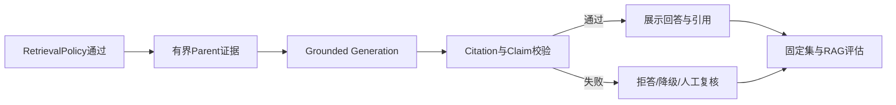
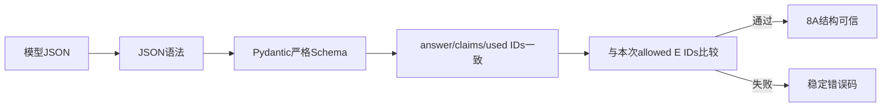
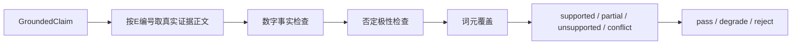

# 第8周：证据约束生成与RAG评估

> 当前状态：8A～8D均已完成。本周不重复实现检索，而是验证模型如何使用已经选出的Parent证据。

## 1. 为什么进入这一周

第7周已经能输出可信Parent、引用ID、覆盖摘要以及回答/澄清/拒答决策，但“把证据交给模型”不等于
“模型一定忠于证据”。第8周把生成结果从一段自由文本升级为可校验、可引用、可批量评估的契约。



## 2. 本周完成标准

- 回答中的事实声明必须映射到存在的`E1...En`证据ID。
- 模型不能引用未提供的证据，也不能在无证据分支自由生成答案。
- 能识别证据冲突、引用缺失、多实体回答不完整和无依据扩写。
- 固定集同时覆盖answer、clarify、refuse、conflict和multi-entity。
- 报告区分检索失败、生成失败、引用失败和Judge不确定，而不是只给一个总分。
- 页面能展示回答、引用来源、校验结果和安全降级原因。

## 3. 四个实施模块

| 模块 | 学习重点 | 主要产物 | 状态 |
|---|---|---|---|
| 8A | Grounded Output Contract | 结构化回答Schema、证据约束Prompt、引用ID校验 | 已完成 |
| 8B | Claim Verification | 声明到证据映射、冲突/完整性检查、失败降级 | 已完成 |
| 8C | RAG Evaluation | Golden Dataset、Faithfulness、Relevancy、Citation指标 | 已完成 |
| 8D | 产品接入与复盘 | Chat引用展示、评估报告、失败样本阅读与本周总结 | 已完成 |

## 4. 8A Grounded Output Contract（已完成）

### 4.1 输入不变

继续使用第7周生成的有界证据JSON：

```json
{
  "evidence": [
    {
      "evidence_id": "E1",
      "document_title": "大会员开通说明",
      "business_domain": "membership",
      "content": "支付成功后通常立即生效……"
    }
  ]
}
```

### 4.2 输出从自由文本升级为结构化契约

计划定义类似下面的模型输出，不允许额外字段：

```json
{
  "answer": "支付成功后通常立即生效[E1]。",
  "claims": [
    {
      "text": "支付成功后通常立即生效。",
      "evidence_ids": ["E1"]
    }
  ],
  "used_evidence_ids": ["E1"],
  "completeness": "complete"
}
```

`answer`供用户阅读，`claims`用于逐条校验，`used_evidence_ids`用于快速审计，`completeness`声明模型是否
认为证据足够。最终是否允许回答仍由确定性Policy决定，不能让模型自行越权。

### 4.3 已完成代码范围

- `knowledge/grounded_answer.py`新增`GroundedAnswer`、`GroundedClaim`和完整度枚举。
- `grounded_support:v2`明确只可使用输入证据，并要求声明级引用和严格JSON对象。
- `StructuredOutputParser(GroundedAnswer)`从同一Pydantic类型生成Provider JSON Schema并解析响应。
- 增加空引用、集合不一致、额外字段、非法ID和空证据上下文测试。
- Conversation先保留兼容边界，不在8A立即重写整个页面和评估系统。

### 4.4 三层校验



第一层拒绝非JSON；第二层拒绝空字段、额外字段、非法枚举和空引用；第三层要求claims使用的ID集合、
`used_evidence_ids`和answer中的`[E1]`引用集合完全相等；最后再与本次真实证据ID白名单比较。8A只证明
“引用存在且身份正确”，尚不证明claim语义真的被证据支持，后者属于8B。

### 4.5 本步骤思考题与答案

1. 为什么引用必须使用内部`evidence_id`，而不能让模型自由生成标题？
2. 为什么`claims`不能只保存整段answer对应一个引用？
3. 模型输出`completeness=complete`为什么仍不能代替确定性覆盖检查？
4. 引用存在是否等于该声明真的被证据支持？

**Q1：为什么引用必须使用内部`evidence_id`，不能让模型自由生成标题？**

答：标题可能重复、被模型改写或来自不可信正文；`E1...En`由服务端针对本次有界证据生成，可以准确映射
到Parent、文档和内容版本，也能直接拒绝本次上下文不存在的编号。

**Q2：为什么`claims`不能只保存整段answer对应一个引用？**

答：一段回答可能同时包含生效时间、退款条件和操作路径。整段只挂一个引用无法判断具体哪条事实缺乏支持；
声明级拆分使8B可以逐条执行支持度和冲突校验。

**Q3：`completeness=complete`为什么不能代替确定性覆盖检查？**

答：这是模型自我声明，不是可靠业务事实。第7D策略层仍先检查实体覆盖、阈值和证据数量，模型不能通过
输出`complete`绕过回答门禁。

**Q4：引用存在是否等于声明真的被证据支持？**

答：不等于。8A只能确认ID格式正确且属于本次证据；模型仍可能把真实E1挂到不受E1支持的claim上。
8B将实现claim到证据的语义支持、冲突和完整性检查。

## 5. 阅读路线

```text
knowledge/evidence.py
→ llm/prompts.py
→ knowledge/grounded_answer.py
→ llm/structured.py
→ llm/service.py（当前仍固定grounded_support:v1）
→ conversations.py
→ 第8周评估器
```

先理解证据契约，再阅读Prompt和模型解析，最后才进入Conversation接线，避免从页面反向猜业务逻辑。
8A保留`grounded_support:v2`作为原始结构契约；8D兼容修复发布`grounded_support:v3`，为只支持
`json_object`的DeepSeek补充完整JSON形状和一次受限结构重试；随后发布v4要求最小、最直接证据。
正式知识Chat使用v4，普通闲聊仍使用`support_answer:v1`，所有历史版本均可回溯。

## 6. 8B Claim Verification（已完成）

### 6.1 目标与边界

8A只能证明引用编号存在且内部一致，8B继续判断每条Claim是否受到它所引用正文的支持。实现位于
`knowledge/claim_verification.py`，采用确定性校验器而不是让同一个模型自证正确：

1. Claim正文完全包含于证据时直接判定`supported`；
2. Claim新增证据中不存在的金额、时长、百分比等数字事实时判定`unsupported`；
3. 高词元覆盖但否定极性相反时判定`conflict`；
4. 中文二元语义词元覆盖达到阈值时区分`supported`、`partial`和`unsupported`；
5. 任一Claim冲突或不支持则总决策`reject`，部分支持或模型声明`partial`则`degrade`，全部支持才`pass`。



校验器是安全门禁，不是自然语言推理的最终答案。复杂同义改写可能被保守降级；这比把不确定内容直接发布
更符合企业客服要求。后续可以增加独立Judge作为辅助指标，但Judge不允许绕过确定性门禁。

### 6.2 可定位引用

`KnowledgeCitation`新增`heading_path`、`page_numbers`、`section_title`和确定性`excerpt`：

- Word/Markdown使用章节路径定位；
- PDF使用页码定位；
- FAQ通常以问题标题作为章节末级；
- 摘要直接截取Parent原文，不让模型重新编写“引用内容”。

E1～En仍是本次请求内的安全短ID，但页面现在会显示“文档标题 + 章节/页码 + 原文摘要”。

### 6.3 8B作业与答案

**作业1：解释为什么不能只检查`E1`是否存在。**

答案：模型可能把真实E1挂到E1完全不支持的结论上。ID存在性只防止编造编号，Claim Verification才防止
错误归因和无依据扩写。

**作业2：证据写“立即生效”，模型写“10分钟后生效”，应该如何处理？**

答案：Claim新增了证据中不存在的数字事实，必须判定`numeric_fact_missing`并拒绝发布，不能因为“生效”词汇
相似就视为支持。

**作业3：为什么`partial`不直接展示模型原文？**

答案：当前产品还没有安全地抽取“已支持的子句”并重新组合答案。直接展示整段partial仍可能把不支持部分暴露
给用户，因此本周采用确定性降级文案；后续可实现只发布已验证Claim的安全重建器。

## 7. 8C RAG Evaluation（已完成）

### 7.1 Golden Dataset

`data/evaluation/rag_dev_v1.jsonl`包含6类边界：

| Case | 目标 |
|---|---|
| membership_activation | 单证据正常回答 |
| membership_multi_entity | 多实体、多证据完整回答 |
| missing_account_clarify | 信息不足时澄清 |
| no_evidence_refuse | 无证据拒答 |
| conflicting_refund_rules | 证据冲突不自动裁决 |
| document_prompt_injection | 文档命令不能覆盖系统规则 |

数据契约、加载器、评估器、Markdown/JSON报告和CLI分别位于`evaluation/rag_*.py`。

### 7.2 指标含义

- `decision_accuracy`：answer/clarify/refuse策略是否正确；
- `faithfulness`：被确定性校验为supported的Claim比例；
- `answer_relevancy`：Golden Case要求的回答要点覆盖率；
- `citation_precision`：实际引用中属于本次证据白名单的比例；
- `citation_recall`：期望证据中被答案实际使用的比例；
- `pass_rate`：没有任何分类失败的样本比例。

失败分类明确区分决策、检索、生成、引用、忠实度、相关性、完整性和Judge不确定，避免用一个总分掩盖根因。

### 7.3 固定预测重放

运行：

```powershell
bili-rag-eval
```

会生成`rag_replay_report_v1.md/json`。当前6条固定预测重放均通过。必须注意：

> `fixed_prediction_replay`只证明数据、校验器、指标和报告可重复执行，不代表真实模型质量。

真实模型实验必须保留模型、Prompt、检索策略和数据集版本，并在明确费用后单独执行。

### 7.4 8C作业与答案

**作业1：Faithfulness和Answer Relevancy有什么区别？**

答案：Faithfulness问“答案有没有超出证据”，Relevancy问“答案有没有覆盖用户真正问的内容”。一段完全忠于
证据但答非所问的文字可能Faithfulness高而Relevancy低。

**作业2：为什么需要Citation Precision和Citation Recall两个指标？**

答案：Precision防止引用不存在或无关证据，Recall防止漏掉回答所依赖的关键证据。只看Precision时，模型只引用
一条安全证据但漏掉另一条关键依据也可能得到高分。

**作业3：为什么固定预测100%不能作为上线结论？**

答案：固定预测是人为准备的可重放输入，用来验收评分代码；它没有测试真实模型的随机性、格式失败、幻觉和
Provider差异。上线结论必须来自真实模型固定集、失败样本人工复核和线上分布监控。

## 8. 8D 产品接入与安全降级（已完成）

### 8.1 正式知识Chat链路

知识路径现在调用`ChatService.complete_grounded()`：

```text
检索与策略通过
→ grounded_support:v4 + JSON格式样例/最小直接证据
→ Provider完整响应
→ JSON/Pydantic校验
→ 本次证据ID白名单
→ 8B逐Claim验证
→ pass才发布answer
→ degrade/reject发布确定性安全文案
```

普通聊天仍走原流式文本。知识回答必须完整组装后验证，因此当前以单个已验证delta发布，避免流式过程中先把
未经校验的幻觉展示出来，再在结尾声称失败。

### 8.2 候选证据和实际引用分离

页面不再把所有召回Parent统称为“来源”：

- `候选证据`展示检索提供的E1～En及可定位摘要；
- `实际引用`只展示`GroundedAnswer.used_evidence_ids`；
- `声明校验`展示pass/degrade/reject及四类Claim数量；
- 解析、引用或验证失败展示稳定原因码，不展示模型原始JSON和内部推理。

### 8.3 本地Mock

当请求结构为`grounded_answer`时，Mock Provider会从第一条真实证据生成严格JSON，保证本地页面可演示完整
8A～8D链路；它不会把这次固定Mock结果伪装成真实模型质量。

### 8.4 8D作业与答案

**作业1：为什么知识回答不继续逐Token流式展示？**

答案：逐Token时结构尚未闭合，无法确认引用集合和Claim支持度。如果先展示后校验，错误事实已经到达用户。
本阶段选择“先完整验证，再一次发布”，优先保证正确性。

**作业2：候选证据为什么不能叫最终来源？**

答案：Retriever可能给模型5条Parent，但模型只使用E1。候选描述检索输入，实际引用描述答案依赖，二者必须
分开才能准确审计检索冗余和生成引用行为。

**作业3：验证失败为什么不把模型原始JSON返回页面帮助排错？**

答案：原始响应可能包含注入内容、内部提示、敏感数据或未验证事实。页面只使用稳定错误码；原始内容如需诊断，
应进入受权限控制、脱敏并有保留周期的内部观测系统。

### 8.5 DeepSeek `json_object`兼容修复

真实页面曾出现`invalid_json`。最小诊断确认当前`deepseek-v4-flash`可用，但DeepSeek端点拒绝
`response_format=json_schema`；使用`json_object`时适配器只发送“返回JSON对象”，不会传递完整Pydantic
Schema。真实复现中模型返回了`answer`、`completeness`和`used_evidence_ids`，却省略必填`claims`，因此即使
JSON语法正确也会得到`schema_validation_failed`。

修复没有修改历史v2，而是发布`grounded_support:v3`：

- Prompt明确四个顶层字段缺一不可，并给出含Claim内部字段的完整JSON形状；
- 新增`grounded_parse_retries`，默认一次、最大两次；
- 只对`invalid_json`和`schema_validation_failed`重试；未知E编号和Claim冲突不重试；
- 重试不回传失败原文，只基于原问题和原证据独立重新生成，避免敏感信息和错误内容进入下一轮；
- 两次调用的Token累计到会话审计，每次尝试分别记录稳定operation和错误码。

首次v3真实回归已经返回完整Claims，但8B暴露出一个确定性误判：Parent后半句的“未显示/未到账”被旧逻辑
当成整段证据的否定极性，错误冲突到前半句“立即生效”。否定校验随后改为只比较否定词后局部语义与当前Claim
主题的重叠；“未到账”不会污染“立即生效”，而“支持退款/不支持退款”仍能判定冲突。

最终使用当前真实`deepseek-v4-flash + json_object`回归“大会员开通后多久生效”：v3第一次调用即返回完整
Claim，无需修复重试；解析通过、实际引用为E1、Claim为`supported`、8B总结果为`pass`。

### 8.6 生产环境冲突判断与v4最小引用

页面随后暴露第二个否定误判：E4中的“未立即显示”和Claim中的“立即生效”只共享时间副词“立即”，旧局部
词元逻辑仍可能误判冲突。确定性层现在过滤“立即、通常、目前、已经”等通用副词，并要求相同业务谓词
（退款、到账、显示、生效、续费等）或多个有效词元重叠才能判定极性冲突。因此“未立即显示”不否定
“立即生效”，但“支持退款/不支持退款”仍会判定`conflict`。

同时发布`grounded_support:v4`，要求每条Claim引用能直接支持完整事实的最小证据集合，不因主题相近附加间接
证据。使用页面E1、E4做真实回归时，模型只选择E1，三个Claim均为`supported`，总结果为`pass`。

生产环境不会只依赖该启发式。推荐分层为：确定性数字/枚举/显式否定硬规则；同命题谓词对齐；独立NLI或
Verifier模型输出supported/contradicted/unknown；高风险和unknown进入人工复核。LLM Judge只能提供辅助证据，
不能单独绕过确定性安全门禁，阈值必须通过固定集和真实业务分布校准。

## 9. 第8周完整代码阅读路线

```text
knowledge/evidence.py                 可定位候选证据
→ knowledge/grounded_answer.py       8A输出契约
→ llm/prompts.py                     v2结构契约 / v3兼容 / v4最小直接引用
→ llm/structured.py                  JSON和Pydantic解析
→ knowledge/claim_verification.py    8B逐Claim验证
→ llm/service.py                     complete_grounded边界
→ services/conversations.py          发布/降级和Trace接线
→ ui/support.py                      候选证据、实际引用和校验展示
→ evaluation/rag_types.py            8C评估契约
→ evaluation/rag_runner.py           指标与失败分类
→ evaluation/rag_report.py           报告
```

## 10. 本周结论和已知边界

第8周已经形成“证据输入—结构化生成—引用校验—声明验证—安全发布—固定评估”的闭环。当前确定性中文
支持度算法偏保守，复杂同义表达可能降级；固定重放不代表真实模型指标；知识回答暂不逐Token流式展示。这些是
明确的商业安全取舍，不是被隐藏的限制。下一周进入LangGraph时，会把检索、Verification、回答和人工节点
建模成可恢复的状态化工作流。

## 11. 8E：生产级独立Claim Verifier

8B的词元覆盖适合教学和离线诊断，但不能作为生产语义裁判：同义改写会被误拒，相同词语也不等于相同事实。
8E因此接入独立的`MoritzLaurer/mDeBERTa-v3-base-mnli-xnli`模型。它与生成答案的DeepSeek相互独立，输入是
“引用证据（premise）+ 单条声明（hypothesis）”，输出entailment、neutral、contradiction三类概率。

生产链路采用分层门禁：

```text
GroundedAnswer结构与E编号白名单
  -> 硬规则（空证据、证据中不存在的数字、明确同谓词否定冲突）
  -> 本地NLI（只处理硬规则无法确定的Claim）
  -> Enforce发布策略
       全部supported -> 发布原答案
       部分supported -> 仅拼接已支持Claim及其引用
       全部unknown/unsupported/conflict -> 安全拦截
```

关键生产约束：

- 推理通过`asyncio.to_thread`移出ASGI事件循环，并用锁串行访问单张GPU；
- 模型按需加载并缓存于`data/models/huggingface`，模型目录不进入Git；
- 模型加载或推理失败时返回`nli_verifier_unavailable`并失败关闭，不回退词元启发式或Mock；
- 默认模式为`enforce`；`shadow`只用于上线观察语义阈值，仍不可绕过数字和明确冲突硬门禁；
- Trace记录provider、model、mode、延迟以及逐Claim三分类概率，便于阈值复盘；
- 安全答案重建是确定性拼接，不再次调用生成模型，避免二次引入幻觉。

阅读顺序：`knowledge/claim_verification.py`的契约与本地模型 -> `llm/service.py`的异步调用 ->
`services/conversations.py`的发布策略 -> `ui/support.py`的审计展示 -> `core/config.py`的阈值和设备配置。

### 11.1 思考题与答案

**为什么不能删除校验步骤？** 结构和引用合法只能证明模型“引用了某条证据”，不能证明声明被证据支持。删除后，
编造数字、反转退款规则等内容仍可能携带合法E编号发布。应替换误判严重的语义实现，而不是删除安全职责。

**为什么生成模型不能给自己打分？** 同源模型的错误高度相关，自评还会增加Prompt Injection攻击面。独立NLI缩小了
输入和输出空间，配合确定性硬规则更容易评估、审计和替换。

**生产环境是否永远使用固定阈值？** 不应永远固定。初始阈值来自Claim级Golden Dataset；上线先以Shadow收集分布，
按业务风险、误拒率和冲突召回率校准后再Enforce。高风险业务可使用更高的entailment阈值。

### 11.2 本机落地结果

本机RTX 5060 Ti 16GB已安装`torch 2.13.0+cu130`，CUDA可用；两个候选模型均实际下载和评估。最终模型固定集
17/18（94.4%），热路径平均约281ms/Claim，冲突召回100%，危险误接受为0。唯一错误是保守`unknown`，
没有观察到危险的错误支持。模型已完整
缓存，`.env`设置`local_files_only=true`和`warmup=true`：应用启动时加载并执行真实探针，失败则不进入Ready。
详细数据见`data/evaluation/claim_verification_report_v1.md`。
